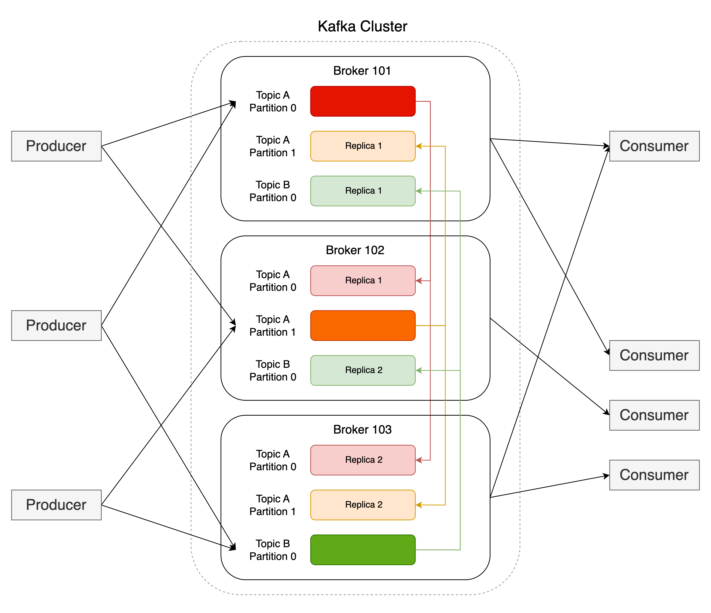

# [Apache Kafka Fundamentals](https://www.youtube.com/playlist?list=PLa7VYi0yPIH2PelhRHoFR5iQgflg-y6JA)

# [動機](https://www.youtube.com/watch?v=BsojaA1XnpM)

如何打造可以處理所有即時 event 及可以將 event 歷史回顧的單一平台。

消峰 和 解偶。

# [Fundamentals](https://www.youtube.com/watch?v=B5j3uNBH8X4)

Producers 和 Consumers 互相解偶，互不知彼此，所以可以各自添加、更新或是 scale up 。



## Producers

能將 message 傳入 Kafka Cluster，傳入之後可能會收到 ack 。

## Brokers

運行 Kafka 的 process ，有自己獨立的硬碟空間。

接收從 Producers 傳來的 Messages 並儲存。

每個 Broker 管理多個 Partitions。

一群相連在一起 Broker 的稱 Kafka Cluster。如果用雲服務，不用太在意這一塊，因為底層實作可能是容器或是機器。


## Consumers

將資料從 Kafka Cluster 拉出來處理，處理後也可以再寫入 Kafka Cluster 。

Kafka 紀錄 consumer 上次處理到哪一筆 message （Consumer offset）。Consumer offset 存放在特定的 topic。


## Zookeeper

管理 cluster，協助分散式的 Brokers 在一些事情上達成一致。（有可能未來會從 Kafka 中移除）

## Topics

不同 Message 的分類。由開發者自己定義。理論上沒有上限，但實務上有。

### Partition

將同個 Topic 切分成多份儲存，讓不同 brokers 有著同一個 topic 但不同的 partition ，這樣就可以一起寫入同一個 topic 的 message 。這也是 Kafka 可以 Scale up 的關鍵因素。

如果一個 partition 只給一個 broker 處理，如果那個 broker 掛了，那個 partition 也會跟著掛掉。所以 Kafka 根據 replication factor (數量) 產生多個 partition 的 replication。其中一個 replica 稱為 Leader ，其他的稱 follower 。Producer 產生 message 時，會連接負責處理 Leader partition 的 broker ，將 message 寫入 Kafka。有著 follower partition 的 broker 則會僅快地向 Leader partition 的 broker 同步資料。

為了 load balancing 和 semantic partitioning ，在設計 producer 時，要常常思考 Partitioning stragegy。如果沒有 hash key ，預設 Partitioning stragegy 就是 Round-Robin ；有 hash key 就是 hash key % number of partitions，所以只要有相同的 hash key 就會進入一樣的 partition。這樣如果資料需要被有序的處理，就可以用同 partition 一一存入。

### Segments

Message 真正被紀錄的地方，真正的 file。

一個一個 Segments file 組成整份 log (log of Segments, or stream)。

當創建 Topic 時，Kafka 會自動分配該 Topic 的 partition ，但不會自動追蹤這些 partition 的大小，也不會自動移動檔案。所以，開發者要負責維持 partition 的平衡。

Message 只會一直加在 Segments 的最後，之前寫入的資料不可改變。

Consumer 只會讀 log ，讀 log 不會讓 log 產生變化。

當 consumer 可以很快地消化 log ，就可以做到很即時的系統。當然，也可以寫一個新的 consumer 從頭處理所有資料。

# [How Kafka Works](https://www.youtube.com/watch?v=jY02MB-sz8I)

## Producer

## Consumer

可以 Subsribe 多個 Topic ，也可以用 Regex 來 subscribe 。

除了一般的 Message Handling ，也可以開發 Error Handling 。

通常會有個 while true 永遠定期去 polling 資料。

## Partition Leadership and Replication

Partion 數量和 Broker 數量彼此沒有特別依賴。你可以一個 topic 有 200 個 Partition 但只有 4 個 Broker；也可以 1 個 Partition 但有 10 個 Brokers。

具體來說，當 Broker 掛掉時，Kafka 集群會自動啟動故障轉移（Failover）過程，將該 Broker 上的 partition 的 **Leader** 角色轉移到其它 Broker 上的 Partition Replica。當故障的 Broker 能重新啟動時，它會成為該 Partition 的 Replica 之一，但不會再擔任 Leader 的角色。

## Data Retention Policy

通常資料是會保留一週（7天）。可以針對全部或某個 Topic 設定日期。也可以針對商業、成本、法規考量設定不同的保留時間。

清除過期資料是以 segment 為單位。

## Producer Design

當 Producer Record `send()` 給 Producer 後，Serializer 會 serialize 資料，交給 Partitioner 。

Partitioner 將資料分配到正確的 Partition 。分配的規則可以自訂。分配好 partition 的 Message 會先存在 batch 等待送給 Kafka Broker 。

### Partitioner 

#### RoundRobinPartitioner

按照輪詢的方式將消息分配到 partition 中。當 Producer 發送消息時，RoundRobinPartitioner 會將消息依次分配給不同的 partition，以實現負載均衡的目標。

#### HashedPartitioner

將消息的 key 作 Hash，然後用 `Hash value %  Partition 數量` 得出該消息應該分配到哪個 partition 中。這樣可以確保相同的 key 的消息總是被分配到同一個 partition 中，以實現數據局部性的目標。


### Producer Guarantees

Producer send Message 後，Broker 有三種模式回應。分別是 none, LEADER, ALL。

**Acks 0 (none)**

Broker 完全不回 ack ，Producer 一直 `send` 就好。延遲最低，也是最不安全。

**Acks 1(LEADER)**

只有 LEADER 確認有收到就會回傳 ack 。

**Acks -1 (ALL)**

Message 進入 Leader Partition 後，Replica 同步時會回 ack 給 Leader Partition 。等所有 Replica 都確認有同步後， Leader Partition 再回 ack 給 Produce。延遲最高，但也最安全。

### Delivery Guarantees

**At most once**

有可能會掉資料，但不會重複。

**At least once**

有可能會重複，但不會掉資料。

**Exactly once**

不會掉資料，也不會重複。是一種 Idempotent producer（確保每次 Message 只會被存入一次，Producer 發送重複的 Message 也不會被存入）。

> ChatGPT
> Idempotent Producer 通過序列號和重試機制確保消息的幂等性，即相同的消息在發送過程中只會被發送一次。這避免了由於重試或錯誤導致的重複處理或數據丟失問題。Idempotent Producer 的幂等性保證僅適用於單個 Producer 實例的生命週期內，並需要將相關配置設置為啟用。

Atomic broadcast problem 提到說在 distributive messaging system 中，要達到 exactly once delivery 是不可能的。但在 Kafka，就算傳多次 message 也有可以實現一筆 message 只被處理一次而達到像是 exactly once delivery 的效果。

Kafka 中的 transaction API，使用起來就像一般 DB 的 transaction 一樣。而這個 transaction API 可以確保每筆 message 只會被處理一次。

## Consumer Group

## 疑難雜症

一個 Partition 只能被一個 Consumer 處理。而一個 Consumer 有可能處理多個 Partition。

### Kafka.js

- Consumer 處理一筆資料後但沒有 commit offset 而 retrun ，接著還是會收到下一筆資料。如果下一筆資料最後有 commit offset ，那麼上一筆資料就會幫當成已處理，重啟後也不會收到上一筆資料。

- 在 consumer.run 資料時，可以多傳一個 heartbeat 的 callback ，這樣在處理高耗時的任務時，中間可以呼叫 `await heartbeat()` 來確保 consumer 不會被判定為死亡。

- 如果 Consumer 處理多個 Partitions，Kafka.js 會按照某個順序處理。有發生某個 partition 短時間內一直沒處理到的情況。

- 總是要設想 message 有可能會有沒有 key 的情況。

- 如果想提高 application 的處理資料的速度，可以使用 batch 處理，並調高 partitionsConsumedConcurrently 。

> 設定 partitionsConsumedConcurrently 的一個指導原則是它不應該大於消費的分區數量。根據您的工作負載是否受 CPU 限制，將其設置為高於邏輯 CPU 核心數量也可能沒有益處。建議從較低的數值開始，並測量增加是否會導致更高的吞吐量。 from: [Partition-aware concurrency](https://kafka.js.org/docs/consuming#a-name-concurrent-processing-a-partition-aware-concurrency)

```javascript
await this.consumer.run({
  // ...
  partitionsConsumedConcurrently: 3,
  eachBatch: async (payload: EachBatchPayload) => {
    // 處理來自每個分區的批次資料
    console.log(`Processing batch from partition: ${payload.batch.partition}`);
    // ... 處理邏輯
  }
});
```


