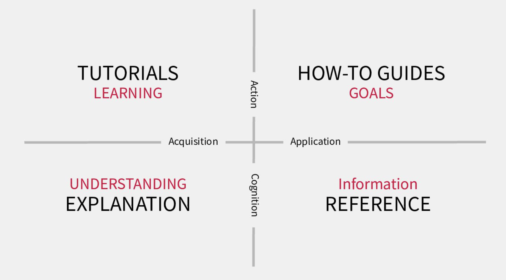
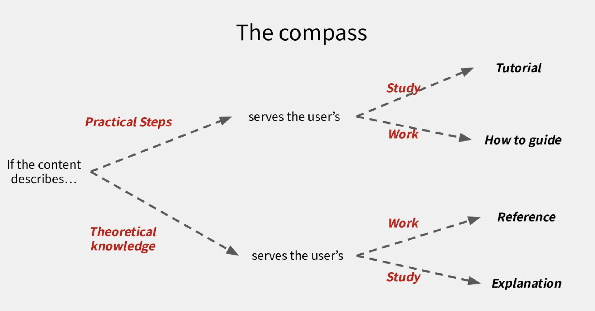

# 使用 Diataxis 建構高質量技術文件

Speaker: jneo8 (J for James)

Qualilty

- Functional Quality: 比較可以量化的文件品質。
- Deep Quality: 人類的主觀感受，比如說閱讀的舒適度。

先有 Functional Quality，再有 Deep Quality。

Diataxis 無法改善你的 functional quality，但可以指出你的 functional quality 有哪些問題。

Toturial 是幫使用者學習，而不是完成某件事情。

