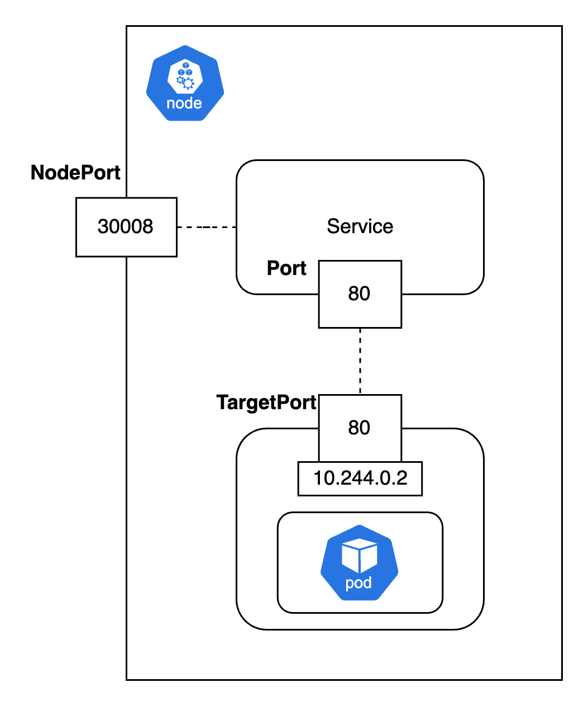

# Certified Kubernetes Administrator (CKA)

# Core Concepts

Kubernetes 是一個 container orchestration system，它可以幫助我們管理一個 cluster 內 container 的生命週期，並且提供了一個平台來管理 container 的部署、擴展、縮減、以及運行。

Cluster 是指一組由 kubernetes 管理的計算、儲存、網路資源，這些資源可以是物理機器、虛擬機器、或是雲端資源。

一個 cluster 會包含多個節點，每個節點可以是實體機器或虛擬機器。節點又分成兩種，一種是 Master Node，另一種是 Worker Node。

**Master Node**

負責管理整個 cluster 的運作。

包含：

- API Server：提供 RESTful API 來管理 cluster。
- Scheduler：負責將 Pod 分配到 Node 上。
- Controller Manager：負責監控 cluster 狀態，並且做出相對應的動作。
- etcd：儲存 cluster 的狀態。

**Worker Node**

負責執行 container，包含：

- Kubelet：負責管理 Pod。
- Kube-proxy：負責網路代理。
- Container Runtime Engine：執行 container。

## Docker vs Containerd

早期 Kubernetes 使用 Docker 作為 container runtime engine，之後 Kubernetes 為了支援其他 container runtime，開發了 CRI（Container Runtime Interface）。只要 container runtime 符合 OCI（Open Container Initiative）標準，就可以使用。

但是 Docker 的 runtime 沒有遵守 OCI 標準，所以 Kubernetes 為了 Docker 開發了一個中間層 dockershim，這個中間層將 Docker 的 API 轉換成 CRI 的 API。

Kubernetes 1.24 版本之後，移除了 dockershim 的支援。因為 Docker 的 image 符合 OCI 標準，所以依舊可以可以使用 Docker 的 image。

Kubernetes 目前是使用 containerd 作為 container runtime engine。 Containerd 是 Docker 的一部分，是一個高度可擴展的 container runtime engine。

## Kube Scheduler

Kube Scheduler 是一個 Kubernetes 的 component，它負責將考慮資源的使用情況及 Pod 的需求，將 Pod **規劃** 至 Node 上，本身不會執行任何 Pod。

## Pod

Pod 是 Kubernetes 的最小單位，它是一個或多個 container 的集合，這些 container 共享相同的 network namespace、IPC namespace、PID namespace、以及 volumes。

## YAML

Kubernetes 使用 YAML 來定義物件，例如 Pod、Service、Deployment 等等。

YAML 的格式是依據 key-value pair，並且使用縮排來表示物件之間的關係。

如果是 dictionary，使用 `key: value` 的格式，如果是 list，使用 `- value` 的格式。

主要有四個 top level 的物件： apiVersion、kind、metadata、spec。

```yaml
apiVersion: v1
kind: Pod
metadata:
  name: myapp-pod
  labels:
    app: myapp
    tier: frontend
spec:
  containers
  - name: nginx
    image: nginx:1.14
  - name: busybox
    image: busybox
```

## Replicaset


Replication Controller 和 replicaset 它的主要功能是維護所期望的 Pod 數量，無論是因為 Pod 故障還是因為手動干預而需要創建或刪除 Pod。可以跨 Node 部署 Pod，並且可以確保指定數量的 Pod 一直在運行。

- ReplicationController：早期(apiVersion: v1)的 controller 之一。適用於簡單的 Pod 副本控制，僅支持等號標籤選擇器，現在較少使用。
- ReplicaSet：ReplicaSet 是 ReplicationController 的改進版本，有進階的 selector 功能，提供更強大和靈活的 Pod 副本管理功能。

以下是一個 replicaset 的 yaml 檔案：

```yaml
apiVersion: apps/v1 # 注意這邊是 apps/v1
kind: ReplicaSet
metadata:
  name: replicaset-1
spec:
  replicas: 2
  selector:
    matchLabels:
      tier: frontend
  template:
    # 下面就是 pod 的定義
    metadata:
      labels:
        tier: frontend
    spec:
      containers:
      - name: nginx
        image: nginx
```

在上面的 yaml 中，spec 的部分有三個重要的欄位：replicas, template 和 selector。

- `replicas` 指定了要創建的 Pod 數量。
- `template` 定義了要創建的 Pod 的規格，其實就是 pod 的 yaml 中，metadata 和 spec 的部分。
- `selector` 用來選擇要操作的 Pod。ReplicaSet 會根據 selector 選擇符合條件的 Pod，並且對這些 Pod 做操作。這樣就算有些 pod 是之前創建的，也會被 ReplicaSet 納入管理。
- `template` 和  `selector` 這**兩個欄位中的 `labels` 必須是一樣的**。


## Deployment

Deployment 是一個高階的物件，它可以管理 ReplicaSet 和 ReplicaSet 中的 Pod。主要功能：

- 滾動更新：可以進行滾動更新，即在不中斷服務的情況下，將舊的 Pod 替換成新的 Pod。
- 回滾：如果更新出現問題，可以回滾到之前的版本。
- 暫停和繼續：可以暫停和繼續更新。

以下是一個 deployment 的 yaml 檔案：

```yaml
apiVersion: apps/v1 
kind: Deployment # 與 replicaset 只差在這邊。注意大寫。
metadata:
  name: replicaset-1
spec:
  replicas: 2
  selector:
    matchLabels:
      tier: frontend
  template:
    metadata:
      labels:
        tier: frontend
    spec:
      containers:
      - name: nginx
        image: nginx
```

## Service

Service 是一個抽象層，它定義了一個 Pod 的訪問方式。Service 可以將 Pod 的 IP 和 Port 暴露給其他的物件，並且可以提供負載平衡的功能。

主要功能：

- NodePort：在每個 Node 上開放一個 Port，其他物件可以通過 Node 的 IP 和 Port 訪問 Service。
- ClusterIP：在 cluster 內部提供一個虛擬 IP，其他物件可以通過這個 IP 訪問 Service。
- LoadBalancer：在 cloud provider 上提供一個 LoadBalancer，其他物件可以通過 LoadBalancer 訪問 Service。

### NodePort

NodePort 是 Service 的一種 type，它會在每個 Node 上開放一個 Port，其他物件可以通過 Node 的 IP 和 Port 訪問 Service 及其背後的 Pod。



以下是一個 NodePort 的 yaml 檔案：

```yaml
apiVersion: v1
kind: Service
metadata:
  name: webapp-service
spec:
  type: NodePort
  selector: # 這個 Service 會將流量轉發到這些 label 的 Pod。也就是 pod-definition 中 metadata.labels 的部分。
    app: myapp
    type: frontend
  ports:
    - targetPort: 80 # Service 會將流量轉發到 Pod 的這個端口。
      nodePort: 30080 # NodePort，在每個 Node 上打開的端口號，使得外部可以通過 <NodeIP>:30080 訪問這個 Service。
      port: 80 # Service 暴露的端口號。
```

假如有多個一樣的 pod 在同一個 Node ，service 會將流量**隨機**平均分配到這些 pod 上。

就算是不同的 Node ，service 也會跨 Node 分配流量。（只要不同 Node 都設定一樣的 nodePort 和 targetPort）

### ClusterIP

ClusterIP 是 Service 的一種 type，它會在 cluster 內部提供一個虛擬 IP，其他物件可以通過這個 IP 訪問 Service 及其背後的 Pod。

```yaml
apiVersion: v1
kind: Service
metadata:
  name: webapp-service
spec:
  type: ClusterIP
  selector: # 這個 Service 會將流量轉發到這些 label 的 Pod。也就是 pod-definition 中 metadata.labels 的部分。
    app: myapp
    type: frontend
  ports:
    - targetPort: 80 # Service 會將流量轉發到 Pod 的這個端口。
      port: 80 # Service 暴露的端口號。
      # 注意這邊沒有 nodePort
```

### LoadBalancer

LoadBalancer 是 Service 的一種 type，它會在 cloud provider 上提供一個 LoadBalancer，LoadBalancer 會分配流量到 Service 及其背後的 Pod。

```yaml
apiVersion: v1
kind: Service
metadata:
  name: webapp-service
spec:
  type: LoadBalancer
  ports:
    - targetPort: 80 
      nodePort: 30080
      port: 80
```

## Namespace

Namespace 是 Kubernetes 的一個概念，它可以將 cluster 分成多個虛擬 cluster，每個 namespace 都有自己的資源，例如 Pod、Service、Deployment 等等。

創建 namespace 的 yaml 檔案：

```yaml
apiVersion: v1
kind: Namespace
metadata:
  name: dev
```

在同一個 namespace 內的資源可以直接訪問，而在不同 namespace 的資源則需要使用 DNS name 來訪問。

例如，如果要訪問不同 namespace 的 service，可以使用 `<service-name>.<namespace>.svc.cluster.local` 來訪問。

如果資源要創在不是 default namespace，可以使用 `-n` 或 `--namespace` 來指定 namespace。或是 yaml 檔案中的 `metadata.namespace`。

```yaml
apiVersion: v1
kind: Pod
metadata:
  name: myapp-pod
  namespace: dev # 指定 namespace
spec:
  ...
```

Namespace 也可以設定 resource quota，限制 namespace 內的資源使用量。

```yaml
apiVersion: v1
kind: ResourceQuota
metadata:
  name: dev-quota
  namespace: dev
spec:
  hard:
    pods: "10" # 限制在 dev namespace 中最多可以運行 10 個 Pod。
    requests.cpu: "4" # 限制在 dev namespace 中所有 Pod 總共最多可以使用 4 個 CPU。
    requests.memory: 5Gi # 限制在 dev namespace 中所有 Pod 總共最多可以使用 5Gi 的記憶體。
    limits.cpu: "10" 
    limits.memory: 10Gi 
```

- requests.cpu: "4"：在 dev namespace 中所有 Pod 請求的 CPU 資源總和最多為 4 個 CPU 核心。
  - 例子：假設有兩個 Pod：
	  - Pod A 請求 1 個 CPU。
    - Pod B 請求 2 個 CPU。
    - 總請求為 3 個 CPU，此時還可以再請求 1 個 CPU。如果總請求超過 4 個 CPU，則無法創建或更新 Pod 來請求更多的 CPU 資源。

- limits.cpu: "10"：在 dev namespace 中所有 Pod 設置的 CPU 上限總和最多為 10 個 CPU 核心。
  - 例子：假設有三個 Pod：
    - Pod A 設置的 CPU 上限為 3 個 CPU。
    - Pod B 設置的 CPU 上限為 4 個 CPU。
    - Pod C 設置的 CPU 上限為 2 個 CPU。
    - 總上限為 9 個 CPU，此時還可以再設置 1 個 CPU 的上限。如果總上限超過 10 個 CPU，則無法創建或更新 Pod 來設置更高的 CPU 上限。

## Imperative vs Declarative 

如果用 Imerative command 會讓其他人很難追蹤，因為他們不知道預期的狀態是怎樣，也無法難以追蹤歷史更新。

用 Imperative command 也需要人為地檢查目前狀態，更新 pod 或設定。

- 比如要更新一個物件，你要先確定他有沒有存在。

Declarative command 則是使用 `kubectl apply -f <file>` 來創建或更新物件。

- 不管是創建或更新，系統都會自動幫你檢查目前的狀態，並且只會更新差異的部分。

# Further Reading

[同樣 2vCPU 的 Kubernetes Container 為什麼會比 VM 效能差](https://www.hwchiu.com/docs/2023/container-vm)

