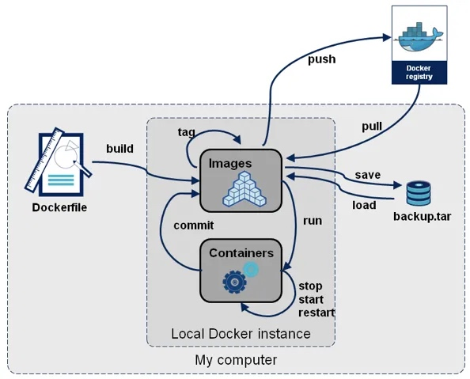

# Docker

主要參考 [Docker容器技術從入門到精通](https://www.udemy.com/course/docker-china/)
及 [其課程 Document](https://www.docker.tips)

# 容器技術的介紹與安裝

## 容器技術的介紹

Container 是一種虛擬化技術，而 Docker 是一種 Container 的實作。

### Container 的標準化

Container 的標準化是由 Open Container Initiative (OCI) 負責。主要有兩個標準：

- Runtime Specification
- Image Specification
    - 不同 Container 的實作（Docker, Podman）的 Image 可以互相使用。

### 與 VM 的比較


<center>圖片來源：<a href=https://www.weave.works/blog/a-practical-guide-to-choosing-between-docker-containers-and-vms>Docker vs Virtual Machines (VMs) : A Practical Guide to Docker Containers and VMs</a></center>


VM 虛擬化完整 OS，運行在 Hypervisor 上。而 Container 不需要虛擬化完整 OS，運行在 container engine 上，container engine 運行在 Host OS 上。

Container 不是迷你的 VM，而是一個一個獨立的 process。這些 process 被隔離及限制資源使用（訪問）。如果 process 被刪除，則 container 也會被停止。

# Container Quick Start

## Basic Command

`docker version`: 查看 Docker 版本。

`docker info`: 查看目前 Docker 的狀態資訊。

`docker container ps -a`: 查看目前所有的 Container。

`docker image ls`: 查看目前所有的 Image。

## Image and Container

Image 是一份 `read-only` 的文件，包含了運行應用程式所需的所有文件、程式碼和依賴。一旦建立，就不會被修改。

Container 是 Image 的執行實例，且在多層 image 之上有 `read-write` 的權限。

## `docker container` 相關指令

執行 `docker container run...` 後，Docker 會做以下事情：

1. 檢查本地是否有指定的 Image，如果沒有，則從 Docker Hub 下載。
2. 使用 Image 建立一個 Container，並執行。

`docker container run [Image Name] [command]`: 建立一個 Container。
- command 是在 Container 中要執行的命令（可以多個參數）。ex: `docker container run busybox echo "Hello World"`
- 如果只要運行一次就結束，可以加上 `--rm`，讓 Container 停止後，自動刪除 Container。

`docker container ps`: 查看目前正在執行的 Container。加 `-a` 可以查看所有的 Container。

`docker container stop [Container ID]`: 停止 Container。

`docker container start [Container ID]`: 啟動被 stop 的 Container。

`docker container rm [Container ID]`: 刪除 Container。
- 無法刪除正在執行的 Container，必須先停止 Container。除非加上 `-f` 選項。

`docker container rm $(docker container ps -aq)`: 刪除所有 Container。
- `-q` 或 `--quiet` 選項表示只顯示容器的短ID（Container ID），而不顯示其他詳細資訊。這將讓輸出更為簡潔。

`docker system prune`: 刪除所有沒有使用的資源（包含 Container、Image、Network、Volume）。


## Attach and Detach Container

Attach 是指連接到 Container 的標準輸入、輸出和錯誤輸出的模式。

- 直接執行 `docker container run [Image Name]`時，就是 Attach 的模式。
- 也可以透過 `docker container attach [Container ID]` 來連接到 Container。

Detach 是指將本地的標準輸入、輸出和錯誤輸出從容器中分離出來的模式。這樣你可以在容器後台運行。

- 使用 -d 或 --detach 選項 `docker container run -d [Image Name]` 運行容器，就可以在容器後台運行。

## 與 Container 互動

`docker container logs [Container ID]`: 查看 Container 的 log。

- `-f` 選項可以持續查看 log。

`docker container run -it alpine sh`:  以交互式模式運行Alpine Linux Image container，並在其中啟動 Shell。

- `-i` 選項表示以交互式模式運行容器。
- `-t` 選項表示在容器內啟動一個虛擬終端（pseudo-TTY）。
- `sh` 是在容器內啟動 Shell 的命令。
- 如果不使用 `-t` 選項或不指定 sh（或其他命令），則容器將沒有虛擬終端，並且在啟動後立即退出。
- 想退出容器，可以使用 `exit` 或 `Ctrl + D`。這時容器會**停止**。

`docker container exec -it [Container ID] sh`: 在已經運行的 Container 中啟動 Shell，並進入 Container 的交互式模式。

- `exec` 是指在已經運行的 Container 中啟動 Shell。
- 如果想退出容器，可以使用 `exit` 或 `Ctrl + D`。這時容器會**繼續運行**。


`docker container top [Container ID]`: 查看 Container 中正在運行的 process。

# Docker Image



<center>圖片來源：<a href=https://www.slideshare.net/TrisM/docker-41045742>Introduction to Docker - What is it and how is it compared to VM's</a></center>


## Get Image

有三種方法可以取得 Image：

1. 從 `registry` 取得 Image。
    - 可以是 Docker Hub、Quay.io 或其他私有的 registry。
2. 從 `Dockerfile` 建立 Image。
3. Load 本機的 Image。
4. 從 Container 建立 Image。在 container 裡把環境和檔案設定好，然後把 commit 成 Image。

## `docker image` 相關指令

`docker image pull [Image Name]`: 從 `registry` 取得 Image，預設版本是 `latest`。

- `docker image pull nginx`: 從 Docker Hub 取得 Image。
- `docker image pull quay.io/aptible/nginx`: 從 Quay.io 取得 Image。

`docker image ls`: 查看目前所有的 Image。

`docker image inspect [Image Name]`: 查看 Image 的詳細資訊，像是：
- Image 的大小、建立時間、作者等等。
- Image 的 Architecture 和 OS 這兩個欄位，可以知道這個 Image 是建立在哪個架構及 OS 上。
- Image 的 Layers，可以知道這個 Image 是由哪些 Layers 組成。

`docker image rm [Image Name]`: 刪除 Image。
- 無法刪除正在使用的 Image，必須先刪除使用該 Image 的 Container（無論是運行中還是被停止）。除非加上 `-f` 選項。
- 如果 Image 有多個版本，需要用指定版本的刪除，像是 `docker image rm nginx:1.17.10`。

`docker image save [Image Name] -o [File Name]`: 將 Image 儲存成 tar 檔。
- `docker image save busybox -o ./busybox`

`docker image load -i [File Name]`: 從 tar 檔載入 Image。
- `docker image load -i ./busybox`

`docker image prune -a`: 刪除所有沒有使用的 Image。 

## 簡介 Dockerfile

Docker 藉由 `Dockerfile` 建立 Image。`Dockerfile` 是一個純文字檔案，裡面包含了一連串的關於 build image 的指令。

如果要執行一隻程式，基本上要有幾個步驟：

1. 安裝程式所需的環境。
2. 準備程式。
3. 執行程式。

將上述步驟對應至 `Dockerfile`：

```dockerfile
FROM [Image Name]
RUN [Command]
ADD [Source] [Destination]
CMD [Command]
```

1. `FROM`: 指定 Image。（設定環境）
2. `RUN`: 執行指令。(設定環境)
3. `ADD`: 將檔案複製到 Image 中。（準備程式）
4. `CMD`: 執行程式。

## 裡用 Dockerfile 建立 Image

`docker image build -t [Image Name] [Dockerfile Path]`: 建立 Image。
- 執行 `FROM`、`RUN`、`ADD` 以建立 Image。
- `-t` 選項可以指定 Image 的名稱，如果名稱後面沒指定版本，預設是 `latest`。
- 如果有多個 Dockerfile，可以用 `-f` 選項指定 Dockerfile 的路徑。

`docker container run [Image Name]`: run Image。
- 執行 Dockerfile 中的 `CMD`。

`docker image tag [Image Name] [New Image Name]`: 為 Image 加上新的 tag。

`docker image push [Image Name]`: 將 Image 上傳到 registry。
- 如果要 push 到 Docker Hub，要先 `docker login`。
- Image 名稱必須是 `username/repository:tag`。

`docker image history [Image Name]`: 查看 Image 的歷史紀錄。

## 將現有的 Container 儲存成 Image

如果在一個 container 內修改的資料，刪除 container 後，資料也會跟著刪除。如果要保留資料，可以將 container 儲存成 image。

`docker container commit [Container ID] [Image Name]`: 將 Container 儲存成 Image。

# Dockerfile

[Dockerfile reference](https://docs.docker.com/engine/reference/builder/)

## `FROM` 指令

`FROM` 指令指定 Image 的名稱，並且可以指定版本。

```dockerfile
FROM [Image Name]:[Version]
```

在選擇 Image 時，可以考慮以下幾點：

- Image 的大小。
- Image 的版本。
- Image 的發行商。
- Image 的安全性。

## `RUN` 指令

`RUN` 指令執行一個命令，並且會在 Image 中建立一個新的 Layer。

```dockerfile
RUN [Command]
```

可以執行多個 `RUN` 指令，像是：

```dockerfile
FROM ubuntu:20.04
RUN apt-get update
RUN apt-get install -y wget
RUN wget https://github.com/ipinfo/cli/releases/download/ipinfo-2.0.1/ipinfo_2.0.1_linux_amd64.tar.gz
RUN tar zxf ipinfo_2.0.1_linux_amd64.tar.gz
RUN mv ipinfo_2.0.1_linux_amd64 /usr/bin/ipinfo
RUN rm -rf ipinfo_2.0.1_linux_amd64.tar.gz
```

但是這樣會造成 Image 的大小變大，因為每個 `RUN` 指令都會建立一個新的 Layer。可以儘量將多個 `RUN` 指令合併成一個 `RUN` 指令，像是：

```dockerfile
FROM ubuntu:20.04
RUN apt-get update && \
    apt-get install -y wget && \
    wget https://github.com/ipinfo/cli/releases/download/ipinfo-2.0.1/ipinfo_2.0.1_linux_amd64.tar.gz && \
    tar zxf ipinfo_2.0.1_linux_amd64.tar.gz && \
    mv ipinfo_2.0.1_linux_amd64 /usr/bin/ipinfo && \
    rm -rf ipinfo_2.0.1_linux_amd64.tar.gz
```

## 操作 file 相關指令

### `ADD` 指令

`ADD` 指令將檔案複製到 Image 中。檔案權限會一併複製。也會自動解壓縮檔案（如果檔案符合壓縮檔格式），並且可以從 URL 複製檔案。

```dockerfile
ADD [Source] [Destination]
```

`ADD` 指令

### `COPY` 指令

`COPY` 指令只會將檔案複製到 Image 中。不會自動解壓縮檔案，也無法從 URL 複製檔案。


```dockerfile
COPY [Source] [Destination]
```

### `WORKDIR` 指令

`WORKDIR` 指令設定 Image 的工作目錄。如果沒有設定，預設是 `/`。如果沒有該目錄，會自動建立。

```dockerfile
FROM ubuntu:20.04
WORKDIR /app
# 將本機的 hello.py 複製到 /app/hello.py
COPY hello.py hello.py
```

### `ENV` 和 `ARG` 指令

`ENV` 和 `ARG` 指令都可以設定環境變數。

`ENV` 指令設定的環境變數會存在 Image 中（可以進到 container 下類似 `env` 指令查看）。

`ARG` 指令設定的環境變數不會存在 Image 中（只用於構建時）。但是好處是可以用 `docker image build --build-arg [ARG Name]=[Value]` 指定 `ARG` 的值。


<center>圖片來源：<a href=https://vsupalov.com/docker-arg-vs-env/>Docker ARG vs ENV</a></center>

### `CMD` 指令

`CMD` 指令設定 Image 的預設執行命令。

- 如果執行 `docker container run [image] [commad]` 時有指定要執行的命令，則 `CMD` 指令會**被忽略**。

- 如果沒有指定要執行的命令，則會執行**最後一個** `CMD` 指令。所以如果不想要執行 Image/Layer 裡，最後的 CMD 指令，可以在最後加上 `CMD []`。

### `ENTRYPOINT` 指令

`ENTRYPOINT` 指令設定 Image 的預設執行命令，不像 `CMD` 指令可以被忽略。

```dockerfile
FROM ubuntu:20.04
ENTRYPOINT ["echo", "hello docker"]
```

```bash
$ docker container run -it --rm demo-entrypoint
hello docker
$ docker container run -it --rm demo-entrypoint echo "hello world"
hello docker echo hello world
$
```

如果想跳過 image 的 `ENTRYPOINT` 指令，可以使用 `--entrypoint` 指定要執行的命令或是設定為 `/bin/bash` 進入 container。

```bash
$ docker container run -it --rm --entrypoint /bin/bash demo-entrypoint
```

### 執行命令的寫法

`CMD` 和 `ENTRYPOINT` 指令都可以用 `shell` 和 `exec` 的寫法。

`shell` 的寫法：

```dockerfile
CMD echo "hello docker"
```

`exec` 的寫法：

```dockerfile
CMD ["echo", "hello docker"]
```

要注意如果是用 `exec` 的寫法，要存取環境變數，除了要用 `${}` 包起來外，還要註明是用 `shell` 來執行。下面這樣寫會無法存取環境變數。

```dockerfile
FROM ubuntu:20.04
ENV NAME=docker
CMD ["echo", "hello $NAME"]
```

要改成，使用 shell 運行 echo 命令，並在 shell 中解析 $NAME。

```dockerfile
FROM ubuntu:20.04
ENV NAME=docker
CMD ["sh", "-c", "echo hello $NAME"]
```

> ChatGPT
> 當你使用 CMD 命令定義要在容器中運行的命令時，Docker 不會通過 shell 執行這個命令，而是直接運行該命令。因此，如果你的 CMD 命令是一個 JSON 數組，Docker 將把整個數組的內容當作命令的部分進行執行。

## Dockerfile 的小技巧

**合理使用 Cache**

Docker 執行每個指令時，會先檢查是否有 Cache。如果有 Cache，則會使用 Cache，而不是重新執行指令。

但如果執行指令時，發現執行內容有修改（比如：`COPY hello.py hello.py` 但 `hello.py` 程式碼有修改），則會從該指令開始，之後的指令都不使用 Cache。

所以如果有一個指令會經常修改，則可以將該指令放在最後，這樣可以減少重新執行指令的次數。

**只複製需要的檔案**

在 image build 的時候，如果是用 `docker image build -t [tag] .` 的方式（最後的 `.` 是當前目錄所有資料），docker 會把目前目錄下的所有檔案當作 build 的 context，這樣會導致 build 的時間變長。

所以可以在 `.dockerignore` 檔案中，設定不要複製的檔案。

```.dockerignore
.vscode
env/
```

**使用多階段（stages）建置**

如果最終的 Image 不會需要用到中間過程的檔案，可以使用多階段建置，這樣可以減少 Image 的大小。

比如：最終產物是一個執行檔，但是在 build 的過程中，需要用到編譯器。這時可以使用多階段建置，第一階段使用編譯器，第二階段只複製執行檔。這樣就不用連編譯器都要放進 Image 中。

```dockerfile
FROM gcc:9.4 AS builder

COPY hello.c /src/hello.c

WORKDIR /src

RUN gcc --static -o hello hello.c


# 基於 alpine:3.13.5 映像建立最終映像
FROM alpine:3.13.5
# 從前一個 builder 階段的容器中複製可執行文件 hello 到本階段的 /src/hello 目錄。
COPY --from=builder /src/hello /src/hello

ENTRYPOINT [ "/src/hello" ]

CMD []
```

**使用非 root 使用者**

因為 Docker 預設使用 root 使用者，所以如果在 Image 中使用 root 使用者，會有安全性的問題。

所以可以在 Image 中建立一個非 root 使用者及非 root 的 group 並且在 `USER` 指令中，切換到非 root 使用者。

```dockerfile
FROM python:3.9.5-slim

RUN pip install flask && \
    # 創建一個名為 flask 的系統群組，然後創建一個名為 flask 的系統使用者，並將使用者添加到 flask 群組中。
    groupadd -r flask && useradd -r -g flask flask && \
    mkdir /src && \
    # 將 /src 目錄的所有權限分配給 flask 群組和使用者。
    chown -R flask:flask /src
# ... 省略 ...
```

但在 mount volume 時，使用非 root 使用者要注意權限的問題。

# Docker Storage

如果 container 被刪除，container 內的資料也會被刪除。如果要保留資料，可以使用幾種方式：

- Volume
- Bind Mount
- tmpfs Mount


<center>圖片來源：<a href=https://docs.docker.com/storage/volumes/>Volumes</a></center>

## Volumes

Volumes 提供了一個容器和容器之間或容器和主機之間的持久化儲存。

有兩種方式可以使用 Volumes：

- 在 Dockerfile 中使用 `VOLUME` 指令。
- 在 `docker container run` 時使用 `-v` 選項。

就算 Container 被刪除，Volume 也不會被刪除。


### Dockerfile `VOLUME` 指令

在 Dockerfile 中使用 `VOLUME` 指令，來指定要持久化的目錄。

```dockerfile
# ... 省略 ...
# 將 /data 設定成為持久化目錄。
VOLUME ["/data"]
# ... 省略 ...
```

每次執行 `docker container run` 時，都會建立一個新的 Volume。


### `docker container run` 時使用 `-v` 選項

在 `docker container run` 時使用 `-v` 選項，來指定要持久化的目錄並且指定 Volume 的名稱。


```bash
$ docker container run -v [Volume Name]:[Container Path] [Image Name]
```

如果沒有指定 Volume 的名稱，則會自動產生一個 Volume 名稱。

```bash
$ docker run -d -v /app my-cron 
0e1c818e4b5166153edb8dcf5837f250a42d7a556980fb32dd01eb753ed15697
$ docker volume ls             
DRIVER    VOLUME NAME
local     fe213b627be3c58170c2eaa6f877c1c5e3bbdd3702bdd7e72771d931b7532133
```

如果有指定 Volume 的名稱，則會使用該 Volume。如果該 Volume 不存在，則會自動建立一個 Volume。

```bash
$ docker run -d -v cron-data:/app my-cron
72bf14597bb43452b044f2c3c70a835004e3e87e7af5232b435c73219956bb2c
$ docker volume ls
DRIVER    VOLUME NAME
local     cron-data
```

### 常用 Volume 指令

`docker volume ls`: 查看目前所有的 Volume。

`docker volume inspect [Volume Name]`: 查看 Volume 的詳細資訊，結果類似如下：


```
[
    {
        "CreatedAt": "2023-08-11T10:15:00Z",
        "Driver": "local",
        "Labels": null,
        "Mountpoint": "/var/lib/docker/volumes/babfdee343df97e23d82ca62d361141b066d1a6511bcf5155fe95ed09c8c324c/_data",
        "Name": "babfdee343df97e23d82ca62d361141b066d1a6511bcf5155fe95ed09c8c324c",
        "Options": null,
        "Scope": "local"
    }
]
```

`Mountpoint` 欄位就是 Volume 的實際位置。如果是 Linux 系統，可以直接到該目錄下查看。但 Windows 和 Mac 需要透過 Docker Desktop 才能查看。

`docker volume rm [Volume Name]`: 刪除 Volume。

`docker volume prune`: 刪除所有沒有被任何 Container 使用的 Volume。

## Bind Mounts

Bind Mounts 提供了一個容器和主機之間的持久化儲存。

在 `docker container run` 時，有兩種方式可以使用 Bind Mounts：

- 使用 `-v` 選項。
- 使用 `--mount` 選項。

兩者差別在於，`--mount` 選項可以指定更多的選項，像是 `readonly`、`volume-opt` 等等。

**使用 `-v` 選項**

```bash
$ docker container run -v [Host Path]:[Container Path] [Image Name]
```

- [Host Path] 一定要是絕對路徑。


如果想將本機的 `/Users/username/data` 目錄掛載到 Container 的 `/data` 目錄：

```bash
$ docker container run -v /Users/username/data:/data image-name
```

**使用 `--mount` 選項**

```bash
$ docker container run --mount type=bind,source=[Host Path],target=[Container Path] [Image Name]
```

如果想要讓 Container 讀取本機的配置文件，但不想讓他修改，就可以使用 `readonly` 選項。

```bash
$ docker run -d --name myapp --mount type=bind,source="$(pwd)"/app,target=/app,readonly your-image-name
```

## 多台機器間共享 Volume

有多種方式可以讓多台機器間共享 Volume，像是 AWS S3、NFS 等。流程大致如下：

1. 在多台機器上安裝 Volume Driver Plugin。
2. 在多台機器上建立 Volume。
3. 在多台機器上建立 Container，並且使用 Volume。

以 sshfs 為例：

在多台機器上安裝 sshfs:

```bash
$ docker plugin install --grant-all-permissions vieux/sshfs
```

在多台機器上建立 Volume:

```bash
$ docker volume create \
    --driver vieux/sshfs \
    -o sshcmd=vagrant@192.168.200.12:/home/vagrant \
    -o password=vagrant \
    sshvolume
```

在多台機器上建立 Container，並且使用 Volume:

```bash
docker container run \
    -it \
    -v sshvolume:/app \
    busybox sh
```


# Other Tools

- [Orbstack](https://orbstack.dev/)
    - Mac 上 Docker Desktop 的替代品。


