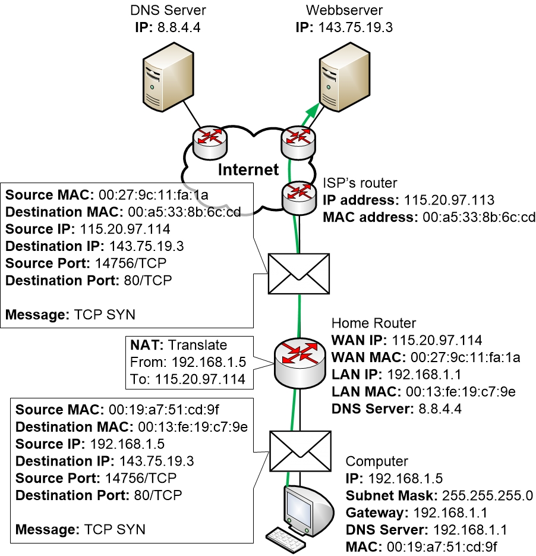
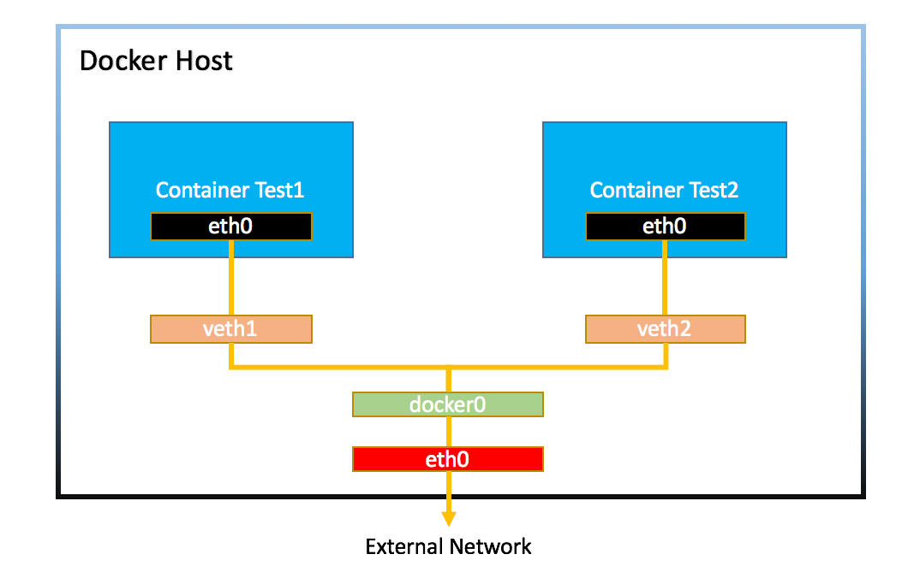
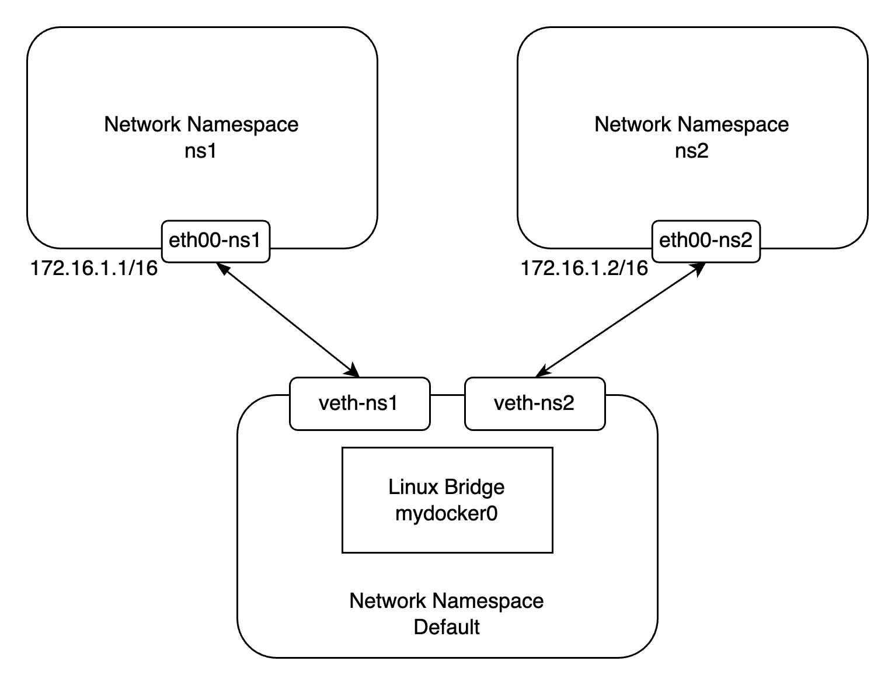
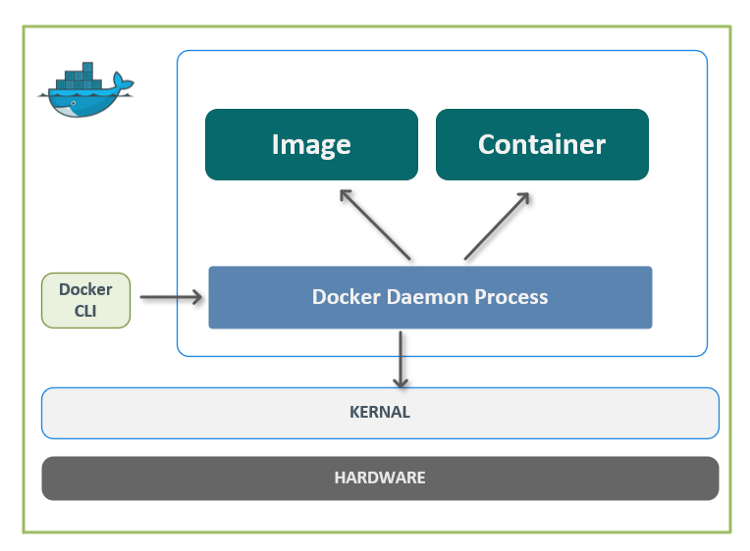
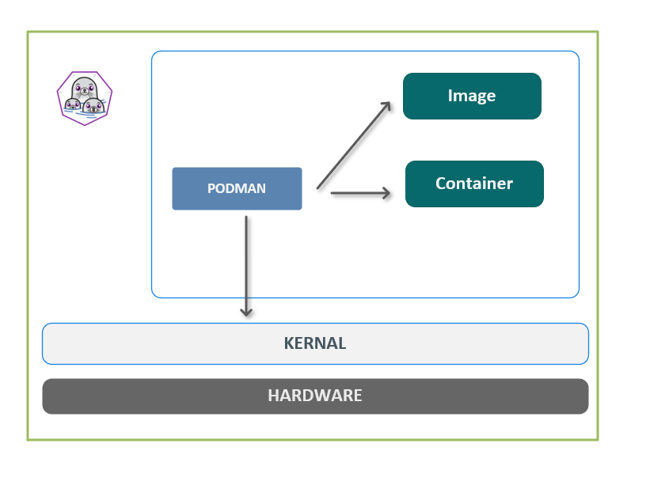

# Docker

主要參考 [Docker容器技術從入門到精通](https://www.udemy.com/course/docker-china/)
及 [其課程 Document](https://www.docker.tips)

# 容器技術的介紹與安裝

## 容器技術的介紹

Container 是一種虛擬化技術，而 Docker 是一種 Container 的實作。

### Container 的標準化

Container 的標準化是由 Open Container Initiative (OCI) 負責。主要有兩個標準：

- Runtime Specification
- Image Specification
    - 不同 Container 的實作（Docker, Podman）的 Image 可以互相使用。

### 與 VM 的比較


<center>圖片來源：<a href=https://www.weave.works/blog/a-practical-guide-to-choosing-between-docker-containers-and-vms>Docker vs Virtual Machines (VMs) : A Practical Guide to Docker Containers and VMs</a></center>


VM 虛擬化完整 OS，運行在 Hypervisor 上。而 Container 不需要虛擬化完整 OS，運行在 container engine 上，container engine 運行在 Host OS 上。

Container 不是迷你的 VM，而是一個一個獨立的 process。這些 process 被隔離及限制資源使用（訪問）。如果 process 被刪除，則 container 也會被停止。

# Container Quick Start

## Basic Command

`docker version`: 查看 Docker 版本。

`docker info`: 查看目前 Docker 的狀態資訊。

`docker container ps -a`: 查看目前所有的 Container。

`docker image ls`: 查看目前所有的 Image。

## Image and Container

Image 是一份 `read-only` 的文件，包含了運行應用程式所需的所有文件、程式碼和依賴。一旦建立，就不會被修改。

Container 是 Image 的執行實例，且在多層 image 之上有 `read-write` 的權限。

## `docker container` 相關指令

執行 `docker container run...` 後，Docker 會做以下事情：

1. 檢查本地是否有指定的 Image，如果沒有，則從 Docker Hub 下載。
2. 使用 Image 建立一個 Container，並執行。

`docker container run [Image Name] [command]`: 建立一個 Container。
- command 是在 Container 中要執行的命令（可以多個參數）。ex: `docker container run busybox echo "Hello World"`
- 如果只要運行一次就結束，可以加上 `--rm`，讓 Container 停止後，自動刪除 Container。

`docker container ps`: 查看目前正在執行的 Container。加 `-a` 可以查看所有的 Container。

`docker container stop [Container ID]`: 停止 Container。

`docker container start [Container ID]`: 啟動被 stop 的 Container。

`docker container rm [Container ID]`: 刪除 Container。
- 無法刪除正在執行的 Container，必須先停止 Container。除非加上 `-f` 選項。

`docker container rm $(docker container ps -aq)`: 刪除所有 Container。
- `-q` 或 `--quiet` 選項表示只顯示容器的短ID（Container ID），而不顯示其他詳細資訊。這將讓輸出更為簡潔。

`docker system prune -f`: 刪除所有沒有使用的資源（包含 Container、Image、Network、Volume）。


## Attach and Detach Container

Attach 是指連接到 Container 的標準輸入、輸出和錯誤輸出的模式。

- 直接執行 `docker container run [Image Name]`時，就是 Attach 的模式。
- 也可以透過 `docker container attach [Container ID]` 來連接到 Container。

Detach 是指將本地的標準輸入、輸出和錯誤輸出從容器中分離出來的模式。這樣你可以在容器後台運行。

- 使用 -d 或 --detach 選項 `docker container run -d [Image Name]` 運行容器，就可以在容器後台運行。

## 與 Container 互動

`docker container logs [Container ID]`: 查看 Container 的 log。

- `-f` 選項可以持續查看 log。

`docker container run -it alpine sh`:  以交互式模式運行Alpine Linux Image container，並在其中啟動 Shell。

- `-i` 選項表示以交互式模式運行容器。
- `-t` 選項表示在容器內啟動一個虛擬終端（pseudo-TTY）。
- `sh` 是在容器內啟動 Shell 的命令。
- 如果不使用 `-t` 選項或不指定 sh（或其他命令），則容器將沒有虛擬終端，並且在啟動後立即退出。
- 想退出容器，可以使用 `exit` 或 `Ctrl + D`。這時容器會**停止**。

`docker container exec -it [Container ID] sh`: 在已經運行的 Container 中啟動 Shell，並進入 Container 的交互式模式。

- `exec` 是指在已經運行的 Container 中啟動 Shell。
- 如果想退出容器，可以使用 `exit` 或 `Ctrl + D`。這時容器會**繼續運行**。


`docker container top [Container ID]`: 查看 Container 中正在運行的 process。

# Docker Image


<center>圖片來源：<a href=https://www.slideshare.net/TrisM/docker-41045742>Introduction to Docker - What is it and how is it compared to VM's</a></center>


## Get Image

有三種方法可以取得 Image：

1. 從 `registry` 取得 Image。
    - 可以是 Docker Hub、Quay.io 或其他私有的 registry。
2. 從 `Dockerfile` 建立 Image。
3. Load 本機的 Image。
4. 從 Container 建立 Image。在 container 裡把環境和檔案設定好，然後把 commit 成 Image。

## `docker image` 相關指令

`docker image pull [Image Name]`: 從 `registry` 取得 Image，預設版本是 `latest`。

- `docker image pull nginx`: 從 Docker Hub 取得 Image。
- `docker image pull quay.io/aptible/nginx`: 從 Quay.io 取得 Image。

`docker image ls`: 查看目前所有的 Image。

`docker image inspect [Image Name]`: 查看 Image 的詳細資訊，像是：
- Image 的大小、建立時間、作者等等。
- Image 的 Architecture 和 OS 這兩個欄位，可以知道這個 Image 是建立在哪個架構及 OS 上。
- Image 的 Layers，可以知道這個 Image 是由哪些 Layers 組成。

`docker image rm [Image Name]`: 刪除 Image。
- 無法刪除正在使用的 Image，必須先刪除使用該 Image 的 Container（無論是運行中還是被停止）。除非加上 `-f` 選項。
- 如果 Image 有多個版本，需要用指定版本的刪除，像是 `docker image rm nginx:1.17.10`。

`docker image save [Image Name] -o [File Name]`: 將 Image 儲存成 tar 檔。
- `docker image save busybox -o ./busybox`

`docker image load -i [File Name]`: 從 tar 檔載入 Image。
- `docker image load -i ./busybox`

`docker image prune -a`: 刪除所有沒有使用的 Image。 

## 簡介 Dockerfile

Docker 藉由 `Dockerfile` 建立 Image。`Dockerfile` 是一個純文字檔案，裡面包含了一連串的關於 build image 的指令。

如果要執行一隻程式，基本上要有幾個步驟：

1. 安裝程式所需的環境。
2. 準備程式。
3. 執行程式。

將上述步驟對應至 `Dockerfile`：

```dockerfile
FROM [Image Name]
RUN [Command]
ADD [Source] [Destination]
CMD [Command]
```

1. `FROM`: 指定 Image。（設定環境）
2. `RUN`: 執行指令。(設定環境)
3. `ADD`: 將檔案複製到 Image 中。（準備程式）
4. `CMD`: 執行程式。

## 用 Dockerfile 建立 Image

`docker image build -t [Image Name] [Dockerfile Path]`: 建立 Image。
- 執行 `FROM`、`RUN`、`ADD` 以建立 Image。
- `-t` 選項可以指定 Image 的名稱，如果名稱後面沒指定版本，預設是 `latest`。
- 如果有多個 Dockerfile，可以用 `-f` 選項指定 Dockerfile 的路徑。

`docker container run [Image Name]`: run Image。
- 執行 Dockerfile 中的 `CMD`。

`docker image tag [Image Name] [New Image Name]`: 為 Image 加上新的 tag。

`docker image push [Image Name]`: 將 Image 上傳到 registry。
- 如果要 push 到 Docker Hub，要先 `docker login`。
- Image 名稱必須是 `username/repository:tag`。

`docker image history [Image Name]`: 查看 Image 的歷史紀錄。

## 將現有的 Container 儲存成 Image

如果在一個 container 內修改的資料，刪除 container 後，資料也會跟著刪除。如果要保留資料，可以將 container 儲存成 image。

`docker container commit [Container ID] [Image Name]`: 將 Container 儲存成 Image。

# Dockerfile

[Dockerfile reference](https://docs.docker.com/engine/reference/builder/)

## `FROM` 指令

`FROM` 指令指定 Image 的名稱，並且可以指定版本。

```dockerfile
FROM [Image Name]:[Version]
```

在選擇 Image 時，可以考慮以下幾點：

- Image 的大小。
- Image 的版本。
- Image 的發行商。
- Image 的安全性。

## `RUN` 指令

`RUN` 指令執行一個命令，並且會在 Image 中建立一個新的 Layer。

```dockerfile
RUN [Command]
```

可以執行多個 `RUN` 指令，像是：

```dockerfile
FROM ubuntu:20.04
RUN apt-get update
RUN apt-get install -y wget
RUN wget https://github.com/ipinfo/cli/releases/download/ipinfo-2.0.1/ipinfo_2.0.1_linux_amd64.tar.gz
RUN tar zxf ipinfo_2.0.1_linux_amd64.tar.gz
RUN mv ipinfo_2.0.1_linux_amd64 /usr/bin/ipinfo
RUN rm -rf ipinfo_2.0.1_linux_amd64.tar.gz
```

但是這樣會造成 Image 的大小變大，因為每個 `RUN` 指令都會建立一個新的 Layer。可以儘量將多個 `RUN` 指令合併成一個 `RUN` 指令，像是：

```dockerfile
FROM ubuntu:20.04
RUN apt-get update && \
    apt-get install -y wget && \
    wget https://github.com/ipinfo/cli/releases/download/ipinfo-2.0.1/ipinfo_2.0.1_linux_amd64.tar.gz && \
    tar zxf ipinfo_2.0.1_linux_amd64.tar.gz && \
    mv ipinfo_2.0.1_linux_amd64 /usr/bin/ipinfo && \
    rm -rf ipinfo_2.0.1_linux_amd64.tar.gz
```

## 操作 file 相關指令

### `ADD` 指令

`ADD` 指令將檔案複製到 Image 中。檔案權限會一併複製。也會自動解壓縮檔案（如果檔案符合壓縮檔格式），並且可以從 URL 複製檔案。

```dockerfile
ADD [Source] [Destination]
```

`ADD` 指令

### `COPY` 指令

`COPY` 指令只會將檔案複製到 Image 中。不會自動解壓縮檔案，也無法從 URL 複製檔案。


```dockerfile
COPY [Source] [Destination]
```

### `WORKDIR` 指令

`WORKDIR` 指令設定 Image 的工作目錄。如果沒有設定，預設是 `/`。如果沒有該目錄，會自動建立。

```dockerfile
FROM ubuntu:20.04
WORKDIR /app
# 將本機的 hello.py 複製到 /app/hello.py
COPY hello.py hello.py
```

### `ENV` 和 `ARG` 指令

`ENV` 和 `ARG` 指令都可以設定環境變數。

`ENV` 指令設定的環境變數會存在 Image 中（可以進到 container 下類似 `env` 指令查看）。

`ARG` 指令設定的環境變數不會存在 Image 中（只用於構建時）。但是好處是可以用 `docker image build --build-arg [ARG Name]=[Value]` 指定 `ARG` 的值。


<center>圖片來源：<a href=https://vsupalov.com/docker-arg-vs-env/>Docker ARG vs ENV</a></center>

### `CMD` 指令

`CMD` 指令設定 Image 的預設執行命令。

- 如果執行 `docker container run [image] [commad]` 時有指定要執行的命令，則 `CMD` 指令會**被忽略**。

- 如果沒有指定要執行的命令，則會執行**最後一個** `CMD` 指令。所以如果不想要執行 Image/Layer 裡，最後的 CMD 指令，可以在最後加上 `CMD []`。

### `ENTRYPOINT` 指令

`ENTRYPOINT` 指令設定 Image 的預設執行命令，不像 `CMD` 指令可以被忽略。

```dockerfile
FROM ubuntu:20.04
ENTRYPOINT ["echo", "hello docker"]
```

```bash
$ docker container run -it --rm demo-entrypoint
hello docker
$ docker container run -it --rm demo-entrypoint echo "hello world"
hello docker echo hello world
```

如果想跳過 image 的 `ENTRYPOINT` 指令，可以使用 `--entrypoint` 指定要執行的命令或是設定為 `/bin/bash` 進入 container。

```bash
$ docker container run -it --rm --entrypoint /bin/bash demo-entrypoint
```

### 執行命令的寫法

`CMD` 和 `ENTRYPOINT` 指令都可以用 `shell` 和 `exec` 的寫法。

`shell` 的寫法：

```dockerfile
CMD echo "hello docker"
```

`exec` 的寫法：

```dockerfile
CMD ["echo", "hello docker"]
```

要注意如果是用 `exec` 的寫法，要存取環境變數，除了要用 `${}` 包起來外，還要註明是用 `shell` 來執行。下面這樣寫會無法存取環境變數。

```dockerfile
FROM ubuntu:20.04
ENV NAME=docker
CMD ["echo", "hello $NAME"]
```

要改成，使用 shell 運行 echo 命令，並在 shell 中解析 $NAME。

```dockerfile
FROM ubuntu:20.04
ENV NAME=docker
CMD ["sh", "-c", "echo hello $NAME"]
```

> ChatGPT
> 當你使用 CMD 命令定義要在容器中運行的命令時，Docker 不會通過 shell 執行這個命令，而是直接運行該命令。因此，如果你的 CMD 命令是一個 JSON 數組，Docker 將把整個數組的內容當作命令的部分進行執行。

## Dockerfile 的小技巧

**合理使用 Cache**

Docker 執行每個指令時，會先檢查是否有 Cache。如果有 Cache，則會使用 Cache，而不是重新執行指令。

但如果執行指令時，發現執行內容有修改（比如：`COPY hello.py hello.py` 但 `hello.py` 程式碼有修改），則會從該指令開始，之後的指令都不使用 Cache。

所以如果有一個指令會經常修改，則可以將該指令放在最後，這樣可以減少重新執行指令的次數。

**只複製需要的檔案**

在 image build 的時候，如果是用 `docker image build -t [tag] .` 的方式（最後的 `.` 是當前目錄所有資料），docker 會把目前目錄下的所有檔案當作 build 的 context，這樣會導致 build 的時間變長。

所以可以在 `.dockerignore` 檔案中，設定不要複製的檔案。

```.dockerignore
.vscode
env/
```

**使用多階段（stages）建置**

如果最終的 Image 不會需要用到中間過程的檔案，可以使用多階段建置，這樣可以減少 Image 的大小。

比如：最終產物是一個執行檔，但是在 build 的過程中，需要用到編譯器。這時可以使用多階段建置，第一階段使用編譯器，第二階段只複製執行檔。這樣就不用連編譯器都要放進 Image 中。

```dockerfile
FROM gcc:9.4 AS builder

COPY hello.c /src/hello.c

WORKDIR /src

RUN gcc --static -o hello hello.c


# 基於 alpine:3.13.5 映像建立最終映像
FROM alpine:3.13.5
# 從前一個 builder 階段的容器中複製可執行文件 hello 到本階段的 /src/hello 目錄。
COPY --from=builder /src/hello /src/hello

ENTRYPOINT [ "/src/hello" ]

CMD []
```

**使用非 root 使用者**

因為 Docker 預設使用 root 使用者，所以如果在 Image 中使用 root 使用者，會有安全性的問題。

所以可以在 Image 中建立一個非 root 使用者及非 root 的 group 並且在 `USER` 指令中，切換到非 root 使用者。

```dockerfile
FROM python:3.9.5-slim

RUN pip install flask && \
    # 創建一個名為 flask 的系統群組，然後創建一個名為 flask 的系統使用者，並將使用者添加到 flask 群組中。
    groupadd -r flask && useradd -r -g flask flask && \
    mkdir /src && \
    # 將 /src 目錄的所有權限分配給 flask 群組和使用者。
    chown -R flask:flask /src
# ... 省略 ...
```

但在 mount volume 時，使用非 root 使用者要注意權限的問題。

# Docker Storage

如果 container 被刪除，container 內的資料也會被刪除。如果要保留資料，可以使用幾種方式：

- Volume
- Bind Mount
- tmpfs Mount


<center>圖片來源：<a href=https://docs.docker.com/storage/volumes/>Volumes</a></center>

## Volumes

Volumes 提供了一個容器和容器之間或容器和主機之間的持久化儲存。

有兩種方式可以使用 Volumes：

- 在 Dockerfile 中使用 `VOLUME` 指令。
- 在 `docker container run` 時使用 `-v` 選項。

就算 Container 被刪除，Volume 也不會被刪除。


### Dockerfile `VOLUME` 指令

在 Dockerfile 中使用 `VOLUME` 指令，來指定要持久化的目錄。

```dockerfile
# ... 省略 ...
# 將 /data 設定成為持久化目錄。
VOLUME ["/data"]
# ... 省略 ...
```

每次執行 `docker container run` 時，都會建立一個新的 Volume。

### `docker container run` 時使用 `-v` 選項

在 `docker container run` 時使用 `-v` 選項，來指定要持久化的目錄並且指定 Volume 的名稱。


```bash
$ docker container run -v [Volume Name]:[Container Path] [Image Name]
```

如果沒有指定 Volume 的名稱，則會自動產生一個 Volume 名稱。

```bash
$ docker run -d -v /app my-cron 
0e1c818e4b5166153edb8dcf5837f250a42d7a556980fb32dd01eb753ed15697
$ docker volume ls             
DRIVER    VOLUME NAME
local     fe213b627be3c58170c2eaa6f877c1c5e3bbdd3702bdd7e72771d931b7532133
```

如果有指定 Volume 的名稱，則會使用該 Volume。如果該 Volume 不存在，則會自動建立一個 Volume。

```bash
$ docker run -d -v cron-data:/app my-cron
72bf14597bb43452b044f2c3c70a835004e3e87e7af5232b435c73219956bb2c
$ docker volume ls
DRIVER    VOLUME NAME
local     cron-data
```

### 常用 Volume 指令

`docker volume ls`: 查看目前所有的 Volume。

`docker volume inspect [Volume Name]`: 查看 Volume 的詳細資訊，結果類似如下：


```
[
    {
        "CreatedAt": "2023-08-11T10:15:00Z",
        "Driver": "local",
        "Labels": null,
        "Mountpoint": "/var/lib/docker/volumes/babfdee343df97e23d82ca62d361141b066d1a6511bcf5155fe95ed09c8c324c/_data",
        "Name": "babfdee343df97e23d82ca62d361141b066d1a6511bcf5155fe95ed09c8c324c",
        "Options": null,
        "Scope": "local"
    }
]
```

`Mountpoint` 欄位就是 Volume 的實際位置。如果是 Linux 系統，可以直接到該目錄下查看。但 Windows 和 Mac 需要透過 Docker Desktop 才能查看。

`docker volume rm [Volume Name]`: 刪除 Volume。

`docker volume prune`: 刪除所有沒有被任何 Container 使用的 Volume。

## Bind Mounts

Bind Mounts 提供了一個容器和主機之間的持久化儲存。

在 `docker container run` 時，有兩種方式可以使用 Bind Mounts：

- 使用 `-v` 選項。
- 使用 `--mount` 選項。

兩者差別在於，`--mount` 選項可以指定更多的選項，像是 `readonly`、`volume-opt` 等等。

**使用 `-v` 選項**

```bash
$ docker container run -v [Host Path]:[Container Path] [Image Name]
```

- [Host Path] 一定要是絕對路徑。


如果想將本機的 `/Users/username/data` 目錄掛載到 Container 的 `/data` 目錄：

```bash
$ docker container run -v /Users/username/data:/data image-name
```

**使用 `--mount` 選項**

```bash
$ docker container run --mount type=bind,source=[Host Path],target=[Container Path] [Image Name]
```

如果想要讓 Container 讀取本機的配置文件，但不想讓他修改，就可以使用 `readonly` 選項。

```bash
$ docker run -d --name myapp --mount type=bind,source="$(pwd)"/app,target=/app,readonly your-image-name
```

## 多台機器間共享 Volume

有多種方式可以讓多台機器間共享 Volume，像是 AWS S3、NFS 等。流程大致如下：

1. 在多台機器上安裝 Volume Driver Plugin。
2. 在多台機器上建立 Volume。
3. 在多台機器上建立 Container，並且使用 Volume。

以 sshfs 為例：

在多台機器上安裝 sshfs:

```bash
$ docker plugin install --grant-all-permissions vieux/sshfs
```

在多台機器上建立 Volume:

```bash
$ docker volume create \
    --driver vieux/sshfs \
    -o sshcmd=vagrant@192.168.200.12:/home/vagrant \
    -o password=vagrant \
    sshvolume
```

在多台機器上建立 Container，並且使用 Volume:

```bash
docker container run \
    -it \
    -v sshvolume:/app \
    busybox sh
```

# Docker Network

Docker Network 提供了一個容器和容器之間或容器和主機之間的網路連線。

## Network 基礎



<center>圖片來源：<a href=https://www.homenethowto.com/advanced-topics/traffic-example-the-full-picture/>Traffic example, the full picture</a></center>

幾個常用指令：

- `ifconfig`: 查看網路介面的資訊。
- `ip addrping`: 查看網路介面的資訊(更詳細)。
- `ping`: 測試網路是否通。
- `telnet`: 測試 TCP 連線。
- `tracepath`: 查看封包的路徑。

## Container Network 的議題

- Container 如何得到 IP 位址？
- 為什麼 Host 可以 PING 到 Container？
- 為什麼 Container 之間可以互相 PING 到？
- Container 如何連線到外部網路？
- Container 的 Port 是如何轉發？

## Docker Bridge Network




<center>圖片來源：<a href=https://dockertips.readthedocs.io/en/latest/single-host-network/docker-bridge.html>Docker Bridge 网络</a></center>

### 容器之間的網路

兩台電腦如果用網路線互連，配置好彼此的 IP 位址，就可以互相通訊。但如果有多台電腦，不可能每台電腦網路線一一相連，就需要一個交換器（Switch）來連接多台電腦。

Switch 會用 DCP 協定，來自動分配 IP 位址給電腦。每台電腦會有一個預設的 Gateway，預設連至 switch。

在 Docker 中，Bridge就是一個 Switch，每個 Container 會有一個 IP 位址，並且會有一個預設的 Gateway。

Docker 會自動建立 Bridge Network，如果封包是要傳給同為內網的 container，就會直接轉發。下面的 `docker0` 即是 Bridge Network:

```bash
$ ifconfig
docker0: flags=4099<UP,BROADCAST,MULTICAST>  mtu 1500
        inet 172.17.0.1  netmask 255.255.0.0  broadcast 172.17.255.255
        ether 02:42:c3:4e:b2:91  txqueuelen 0  (Ethernet)
        RX packets 0  bytes 0 (0.0 B)
        RX errors 0  dropped 0  overruns 0  frame 0
        TX packets 0  bytes 0 (0.0 B)
        TX errors 0  dropped 0 overruns 0  carrier 0  collisions 0

ens4: flags=4163<UP,BROADCAST,RUNNING,MULTICAST>  mtu 1460
        inet 10.142.0.7  netmask 255.255.255.255  broadcast 0.0.0.0
        inet6 fe80::4001:aff:fe8e:7  prefixlen 64  scopeid 0x20<link>
        ether 42:01:0a:8e:00:07  txqueuelen 1000  (Ethernet)
        RX packets 175723896  bytes 118267582558 (118.2 GB)
        RX errors 0  dropped 0  overruns 0  frame 0
        TX packets 242554177  bytes 112031949582 (112.0 GB)
        TX errors 0  dropped 0 overruns 0  carrier 0  collisions 0

lo: flags=73<UP,LOOPBACK,RUNNING>  mtu 65536
        inet 127.0.0.1  netmask 255.0.0.0
        inet6 ::1  prefixlen 128  scopeid 0x10<host>
        loop  txqueuelen 1000  (Local Loopback)
        RX packets 34917734  bytes 100221718551 (100.2 GB)
        RX errors 0  dropped 0  overruns 0  frame 0
        TX packets 34917734  bytes 100221718551 (100.2 GB)
        TX errors 0  dropped 0 overruns 0  carrier 0  collisions 0
```

`docker network ls`: 可以查看目前所有的 Network。

```bash
$ docker network ls
NETWORK ID     NAME      DRIVER    SCOPE
e7ad19deaec2   bridge    bridge    local
54a27455a865   host      host      local
ac5a26bf649d   none      null      local
```

`docker network inspect [Network Name]`: 可以查看 Network 的詳細資訊。

```bash
$ docker network inspect e7ad19deaec2
[
    {
        "Name": "bridge",
        "Id": "e7ad19deaec2a69dd0ce885b9a7e80e60960443b56820fddcf87a1099c11d63b",
        "Created": "2023-08-12T07:36:59.726258518Z",
        "Scope": "local",
        "Driver": "bridge",
        "EnableIPv6": false,
        "IPAM": {
            "Driver": "default",
            "Options": null,
            "Config": [
                {
                    "Subnet": "172.17.0.0/16"
                }
            ]
        },
 # ... 省略 ...
        "Containers": {
            "129ad07763d6487fdbfed201b4b2b721ebf0442441b40d534ffad05c943cf489": {
                "Name": "box2",
                "EndpointID": "9b8ef6d296aea92ff058049ea166011157e59c5186720f58ad54b8e23085dade",
                "MacAddress": "02:42:ac:11:00:04",
                "IPv4Address": "172.17.0.4/16",
                "IPv6Address": ""
            },
            "950dc8812b9bedf583c9c74f3d196c82de615f0fbb75705580d9379076b08f15": {
                "Name": "box3",
                "EndpointID": "b5dc7b752c61ec0389717784d0d9a7cd43a5aa86d4792246129742e4fdcc26ea",
                "MacAddress": "02:42:ac:11:00:03",
                "IPv4Address": "172.17.0.3/16",
                "IPv6Address": ""
            },
            "bae5e910a5e1662956cf9970b6b2864cba08beb0bf1458ab73f3eeaac20ec3be": {
                "Name": "box1",
                "EndpointID": "a2e8404f99520f579e415e9b011133cf52a57817eb4cca8904d8e52f01049d62",
                "MacAddress": "02:42:ac:11:00:02",
                "IPv4Address": "172.17.0.2/16",
                "IPv6Address": ""
            }
        },
    # ... 省略 ...
```

- Docker 會從 `subnet` 中分配 IP 位址給 Container。
- `Containers` 欄位會列出目前 Container 的 Network。

`brctl show`: 可以查看 Bridge Network 的詳細資訊。

```bash
$ brctl show
bridge name     bridge id               STP enabled     interfaces
docker0         8000.0242759468cf       no              veth8c9bb82
                                                        vethd8f9afb`
```

### 容器對外部的網路

如果 Bridge Network 收到 container 發出的封包，檢查目的地不是 Bridge Network 內部 Container，就會將封包轉發到 Host 的 Network。

查看 IP 路由表：

```bash
$ ip route
default via 10.142.0.1 dev ens4 proto dhcp src 10.142.0.7 metric 100 
10.142.0.1 dev ens4 proto dhcp scope link src 10.142.0.7 metric 100 
172.17.0.0/16 dev docker0 proto kernel scope link src 172.17.0.1 
```

Host 的 Network 再把資料發出去。發出去之前會進行 NAT（Network Address Translation）。可以查看 NAT 規則：

```bash
$ sudo iptables --list -t nat
Chain PREROUTING (policy ACCEPT)
target     prot opt source               destination
DOCKER     all  --  anywhere             anywhere             ADDRTYPE match dst-type LOCAL

Chain INPUT (policy ACCEPT)
target     prot opt source               destination

Chain OUTPUT (policy ACCEPT)
target     prot opt source               destination
DOCKER     all  --  anywhere            !loopback/8           ADDRTYPE match dst-type LOCAL

# 注意這段
Chain POSTROUTING (policy ACCEPT)
target     prot opt source               destination
MASQUERADE  all  --  172.17.0.0/16        anywhere

Chain DOCKER (2 references)
target     prot opt source               destination
RETURN     all  --  anywhere             anywhere
```

- 在 POSTROUTING 可以看到有一個 `MASQUERADE` 規則，這個規則將所有來自 172.17.0.0/16 子網的封包進行 MASQUERADE，這是一種 Network Address Translation（NAT）操作，用於將內部網絡的 IP 地址轉換為外部網絡的公共 IP 地址，從而允許多個內部設備共享單個公共 IP 地址。
- [NAT Explained - Network Address Translation](https://www.youtube.com/watch?v=FTUV0t6JaDA): 這個機制原本是要解決 IPv4 位址不夠用的問題，但現在 IPv6 已經普及，所以這個機制已經不太需要了。

Container 因此可以連線到外部網路，且外部網路看到的 IP 位址都是 Host 的 IP 位址。


## docker network 相關指令

`docker network create [Network Name]`: 建立一個新的 Network。幾個主要的選項：
- `-d`: 指定 Network 的 Driver，預設是 Bridge。
- `--subnet`: 指定 Network 的 subnet。
- `--gateway`: 指定 Network 的 gateway。


`docker container run --network [Network Name] [Image Name]`: 建立一個新的 Container，並且指定 Network。

`docker container inspect [Container Name]`: 查看 Container 的詳細資訊，也可以看到 Container 的 Network。像是自己的 IP 、 gateway IP、 目前是哪個 bridge 等等。

`docker network connect [Network Name] [Container Name]`: 將 Container 加入 Network。

- 同一個 Container 可以加入多個 Network。
- 如果 Container 加入多個 Network，則會有多個 IP 位址。

`docker network disconnect [Network Name] [Container Name]`: 將 Container 從 Network 移除。


**自定義 Network**

如果自己創建 Network Bridge，則在 Network 中的 Container 可以用 Container Name 互相連線。但是預設的 Bridge Network 則不行。

```bash
$ docker network create my-network
$ docker container run -d --name box1 --network my-network busybox sleep 1000
$ docker container run -d --name box2 --network my-network busybox sleep 1000
$ docker container exec -it box1 ping box2
```

## Port Forwarding

外部網路要連線到 Container 內的 Port，需要透過 Port Forwarding。

```bash
$ docker container run -d --name box1 -p 8080:80 nginx
```

- `-p 8080:80` 代表將 Host 的 8080 Port 轉發到 Container 的 80 Port。

原理是 Docker 會建立一個 NAT 規則，這個規則在 iptables 中，可以用 `iptables -t nat -nvxL` 查看：

- `-t nat`: 指定要查看的 table。
```
Chain PREROUTING (policy ACCEPT 0 packets, 0 bytes)
    pkts      bytes target     prot opt in     out     source               destination         
       4      276 DOCKER     all  --  *      *       0.0.0.0/0            0.0.0.0/0            ADDRTYPE match dst-type LOCAL

Chain INPUT (policy ACCEPT 0 packets, 0 bytes)
    pkts      bytes target     prot opt in     out     source               destination         

Chain OUTPUT (policy ACCEPT 0 packets, 0 bytes)
    pkts      bytes target     prot opt in     out     source               destination         
       0        0 DOCKER     all  --  *      *       0.0.0.0/0           !127.0.0.0/8          ADDRTYPE match dst-type LOCAL

Chain POSTROUTING (policy ACCEPT 0 packets, 0 bytes)
    pkts      bytes target     prot opt in     out     source               destination         
       0        0 MASQUERADE  all  --  *      !docker0  172.17.0.0/16        0.0.0.0/0           
       0        0 MASQUERADE  tcp  --  *      *       172.17.0.2           172.17.0.2           tcp dpt:80
# 注意這段
Chain DOCKER (2 references)
    pkts      bytes target     prot opt in     out     source               destination         
       0        0 RETURN     all  --  docker0 *       0.0.0.0/0            0.0.0.0/0           
       0        0 DNAT       tcp  --  !docker0 *       0.0.0.0/0            0.0.0.0/0            tcp dpt:8080 to:172.17.0.2:80
```

- `DNAT`：表示目標地址轉換（Destination Network Address Translation）。這個規則是一個 DNAT 規則，用於修改封包的目標地址和端口。
可以看到上面的 `DNAT` 規則，將來自外部網路的封包，轉發到 Container(172.17.0.2) 的 80 Port。
- `dpt:8080`: 表示目標端口（Destination Port）是 8080。

在 Dockerfile 中也可以指定 Port Forwarding:

```dockerfile
FROM nginx:1.21.1
EXPOSE 80
```

`EXPOSE` 不會自動將 Port Forwarding 到 Host，只是告訴 Docker，這個 Image 的 Container 會使用哪些 Port，且讓用戶知道要把外部網路的哪些 Port 轉發到 Container 的哪些 Port。

如果用戶要檢查 Image 的 Port Forwarding 規則，可以用 `docker image inspect [Image Name]` 查看。在結果中的 `ExposedPorts` 欄位可以看到 Port Forwarding 的規則。

```bash
$ docker image inspect nginx
[
    {
       # ... 省略 ...
        "ContainerConfig": {
            # ... 省略 ...
            "ExposedPorts": {
                "80/tcp": {}
            },
 # ... 省略 ...
```

## Host Network

可以在 `docker container run` 時，使用 `--network host` 選項，讓 Container 使用 Host 的 Network。這樣就會像是在 Host 上執行程式一樣，可以使用 Host 的 IP 位址。

```bash
$ docker container run -d --rm --name busybox --network host busybox /bin/sh -c "while true; do sleep 3600; done"
```

進去 Container 查看 IP 位址，可以發現 IP 位址和 Host 的 IP 位址一樣。

這樣就可以使用 `localhost:80` 連線到 Container 的 80 Port。

因為不需要進行 Port Forwarding，所以效能會比 Bridge Network 好。（But ChatGPT 說這樣可能會有安全性的問題）。

## None Network

可以在 `docker container run` 時，使用 `--network none` 選項，讓 Container 不使用任何 Network。

```bash
$ docker container run -d --name web --network none nginx
```

這樣 Container 就無法連線到外部網路，也無法被外部網路連線。主要是用在特定的情境。

## Network Namespace

Network Namespace 是 Linux 的一個功能，可以讓不同的 Process 使用不同的 Network。

在 Docker 中，每個 Container 都會有自己的 Network Namespace，所以每個 Container 都有自己的 IP 位址、Gateway 等等。

測試 Network Namespace 的方式：

- `sudo brctl addbr mydocker0`: 創建 bridge 。
- 利用這個 [script](./66-add-ns-to-br.sh.sh) 創建兩個 namesapce 並 link 至 default namespace。
- `sudo ip link set dev mydocker0 up`： 啟動 mydocker0 。
- `sudo ip netns exec ns1 bash`: 進入 ns1 namespace。接著 ping 看看 ns2 的 IP 位址。




**Further Reading List**

- [NAT - Network Address Translation](https://www.karlrupp.net/en/computer/nat_tutorial)
- [What happens when you open a terminal and enter ‘ls’](https://www.warp.dev/blog/what-happens-when-you-open-a-terminal-and-enter-ls)

# Docker Compose

Docker Compose 是一個用來管理多個 Container 的工具。主要是用 yaml 檔案來定義要建立的 Container。

## Yaml 基本語法

```yaml
version: "3.8" # yaml 檔案的版本

services:
  servicename: # 服務名稱。也是 Bridge Network 裡面的 DNS 名稱。
    image:
    command:
    environment:
    volumes:
    networks:
    ports:
  servicename2:
    image:
    command:
    environment:
    volumes:
    networks:
    ports:
    depends_on: # 依賴的服務名稱。會等到依賴的服務啟動後，才會啟動這個服務。

volumes:
networks:
```


## Docker Compose 基本指令

下指令時，如果不指定 `-f` 選項，則會自動讀取目錄下的 `docker-compose.yml` 檔案。如果沒有在目錄下，則會報錯。

`docker-compose up`: 建立並且執行 Container。

`docker-compose up -d`: 建立並且執行 Container，且在背景執行。

- 如果在背景執行有想看 log，可以用 `docker-compose logs` 指令或是 `docker-compose logs -f` 指令。

`docker-compose down`: 停止並且刪除 Container。

`docker-compose ps`: 查看目前正在執行的 Container。

`docker-compose logs`: 查看 Container 的 log。

`docker-compose exec [Service Name] [Command]`: 在 Container 中執行指令。

`docker-compose build`: 重新建立 Image。

`docker-compose config`: 檢查 yaml 檔案的語法是否正確。

## Build Docker Image with Docker Compose

可以在 `docker-compose.yml` 檔案中，使用 `build` 選項，來建立本地 Image。

docker-compose 會預設查找 build 路徑下的 Dockerfile。

```yaml
version: "3.8"

services:
  flask-demo:
    build: ./flask
    ports:
      - "5000:5000"
    volumes:
      - .:/code
    environment:
      FLASK_ENV: development
```

也可以指定 Dockerfile 的路徑：

```yaml
version: "3.8"

services:
  flask-demo:
    build:
      context: ./flask
      dockerfile: Dockerfile.XXX
    ports:
      - "5000:5000"
    volumes:
      - .:/code
    environment:
      FLASK_ENV: development
```

## 更新容器

 `docker-compose up -d --build`：啟動容器。重複執行此指令時，Docker 檢查是否要更新或建立 Image，再將 Container 停止並且重新建立。如果 Image 存在且沒有更新，則不會重新建立 Container。

`docker-compose up -d --remove-orphans`：啟動時如果發現有 orphan container(現有 Container 不在 docker-compose.yml 中)，則會刪除。

`docker-compose restart`: 重新啟動現有 Container，不會檢查是否有需更新或建立 Image，單純只是重新啟動 Container。

## Docker Compose Network

### Default Network

利用 docker-compose.yml ，試著啟動兩個 Container：


```
~/learn-docker/docker-compose$ docker-compose up -d
```

```yaml
version: "3.8"

services:
  box1:
    image: xiaopeng163/net-box:latest
    command: /bin/sh -c "while true; do sleep 3600; done"

  box2:
    image: xiaopeng163/net-box:latest
    command: /bin/sh -c "while true; do sleep 3600; done"
```

會發現 docker 會自動為這兩個 containers 創立一個新的 Network，命名是專案**名稱**加**下底線**加上 default 。

```bash
~/learn-docker/docker-compose$ docker network list
NETWORK ID     NAME                     DRIVER    SCOPE
660539460bdc   bridge                   bridge    local
b16b9ae4eada   docker-compose_default   bridge    local
500c7c21915e   host                     host      local
04809e70c261   none                     null      local
```

`docker network inspect docker-compose_default` 可以查看這個 network 所連接的 Containers ，以及各 container 的 IP 位址。

```bash
[
    ...
    "Containers": {
            "205c36b7d41bcebb511f657d4707f3157cea04d532f568e28038b683b7dd04a5": {
                "Name": "docker-compose-box2-1",
                "EndpointID": "24d44076a4550a5d13bd160620db61157b6ae1aeb74839058aa5b6c2cad9a958",
                "MacAddress": "02:42:ac:12:00:03",
                "IPv4Address": "172.18.0.3/16",
                "IPv6Address": ""
            },
            "bf65cb8f0af823a9581d55b0bb37a0bf215121e89d90818e699df20e40c6e321": {
                "Name": "docker-compose-box1-1",
                "EndpointID": "6b2e579b4c649969f663b54d715ae6adc4bcb65ac85dcd456ede4dba46a548e8",
                "MacAddress": "02:42:ac:12:00:02",
                "IPv4Address": "172.18.0.2/16",
                "IPv6Address": ""
            }
        },

    ...
]
```

進到其中一個 container 內，可以藉由 container name 或是 service name 來 ping 另一個 container。這是因為 docker 有自己的 DNS server ，會將 container name 轉換成 container 的 IP 位址。

```bash
# 查看 container  
$ docker-compose ps
NAME                    IMAGE                        COMMAND                  SERVICE             CREATED             STATUS              PORTS
docker-compose-box1-1   xiaopeng163/net-box:latest   "/bin/sh -c 'while t…"   box1                17 minutes ago      Up 3 minutes        
docker-compose-box2-1   xiaopeng163/net-box:latest   "/bin/sh -c 'while t…"   box2                17 minutes ago      Up 3 minutes        

# 進入其中一個 container
$ docker container exec -it docker-compose-box1-1 sh

/omd # ping docker-compose-box2-1
PING docker-compose-box2-1 (172.18.0.3): 56 data bytes
64 bytes from 172.18.0.3: seq=0 ttl=64 time=0.824 ms
64 bytes from 172.18.0.3: seq=1 ttl=64 time=0.234 ms
64 bytes from 172.18.0.3: seq=2 ttl=64 time=0.156 ms
^C
--- docker-compose-box2-1 ping statistics ---
3 packets transmitted, 3 packets received, 0% packet loss
round-trip min/avg/max = 0.156/0.404/0.824 ms

/omd # ping box2
PING box2 (172.18.0.3): 56 data bytes
64 bytes from 172.18.0.3: seq=0 ttl=64 time=0.369 ms
64 bytes from 172.18.0.3: seq=1 ttl=64 time=0.381 ms
64 bytes from 172.18.0.3: seq=2 ttl=64 time=0.139 ms
^C
--- box2 ping statistics ---
3 packets transmitted, 3 packets received, 0% packet loss
round-trip min/avg/max = 0.139/0.296/0.381 ms
```

利用 `dig` 指令，可以查看 container name 轉換成 IP 位址的過程。其中 127.0.0.11 是 docker 的 DNS server。

```bash
$ docker container exec -it docker-compose-box1-1 sh
/omd # dig box2

; <<>> DiG 9.18.10 <<>> box2
;; global options: +cmd
;; Got answer:
;; ->>HEADER<<- opcode: QUERY, status: NOERROR, id: 37759
;; flags: qr rd ra; QUERY: 1, ANSWER: 1, AUTHORITY: 0, ADDITIONAL: 0

;; QUESTION SECTION:
;box2.				IN	A

;; ANSWER SECTION:
box2.			600	IN	A	172.18.0.3

;; Query time: 0 msec
;; SERVER: 127.0.0.11#53(127.0.0.11) (UDP)
;; WHEN: Sat Mar 23 10:47:08 UTC 2024
;; MSG SIZE  rcvd: 42
```

如果在容器外，可以 ping Docker 的 DNS server，但是 ping 不到 container name(ex: box1)，只能 ping container 的 IP 位址。

這是因為主機的 DNS server 不是 Docker 的 DNS server，所以不知道 container name 要轉換成什麼 IP 位址。可以藉由查看 `/etc/resolv.conf` 來查看容器或主機的 DNS server 設定。

容器會先找自己的 DNS server，如果找不到，就會找主機的 DNS server。

### 自定義 Network

可以在 `docker-compose.yml` 檔案中，使用 `networks` 選項，來建立自定義 Network。

```yaml
version: "3.8"

services:
  box1:
    image: xiaopeng163/net-box:latest
    command: /bin/sh -c "while true; do sleep 3600; done"
    networks:
      - mynetwork1
  box2:
    image: xiaopeng163/net-box:latest
    command: /bin/sh -c "while true; do sleep 3600; done"
    networks:
      - mynetwork1
      - mynetwork2

networks:
  mynetwork1:
  mynetwork2:
```

啟動 Container 時，會自動建立 `mynetwork1` 和 `mynetwork2` 兩個 Network。這兩個 Network 會使用 default 的 network driver。

```bash
$ docker-compose up -d
[+] Running 4/4
 ✔ Network docker-compose_mynetwork1  Created                                                                           0.0s 
 ✔ Network docker-compose_mynetwork2  Created                                                                           0.0s 
 ✔ Container docker-compose-box1-1    Started                                                                          10.3s 
 ✔ Container docker-compose-box2-1    Started                                                                          10.3s
```

Default 是指根據環境決定使用哪種 driver。如果是單機的情況，則會使用 bridge driver。

```bash
$ docker network ls
NETWORK ID     NAME                        DRIVER    SCOPE
660539460bdc   bridge                      bridge    local
b16b9ae4eada   docker-compose_default      bridge    local
70aad70e0c24   docker-compose_mynetwork1   bridge    local
5c430db865ba   docker-compose_mynetwork2   bridge    local
500c7c21915e   host                        host      local
04809e70c261   none                        null      local
```

### 自定義 Network 的設定

官方文檔有很多關於自定義 Network 的設定，像是 subnet、gateway 等等。

```yaml
version: "3.8"

services:
  box1:
    image: xiaopeng163/net-box:latest
    command: /bin/sh -c "while true; do sleep 3600; done"
    networks:
      - mynetwork1
  box2:
    image: xiaopeng163/net-box:latest
    command: /bin/sh -c "while true; do sleep 3600; done"
    networks:
      - mynetwork1
      - mynetwork2

networks:
    mynetwork1:
        ipam:
            driver: default
            config:
                - subnet: "172.16.238.0/24"
    mynetwork2:
        ipam:
            driver: default
```

`ipam` 是 IP Address Management 的縮寫，可以設定 subnet、gateway 等等。重啟後，可以進入 Container 確認 IP 位址在 yaml 檔案中設定的 subnet 中。

```bash
$ docker-compose up -d`
$ docker container exec -it docker-compose-box1-1 sh
/omd # ifconfig
eth0      Link encap:Ethernet  HWaddr 02:42:AC:10:EE:03  
          inet addr:172.16.238.3  Bcast:172.16.238.255  Mask:255.255.255.0
          UP BROADCAST RUNNING MULTICAST  MTU:1500  Metric:1
          RX packets:15 errors:0 dropped:0 overruns:0 frame:0
          TX packets:0 errors:0 dropped:0 overruns:0 carrier:0
          collisions:0 txqueuelen:0 
          RX bytes:1306 (1.2 KiB)  TX bytes:0 (0.0 B)

lo        Link encap:Local Loopback  
          inet addr:127.0.0.1  Mask:255.0.0.0
          UP LOOPBACK RUNNING  MTU:65536  Metric:1
          RX packets:0 errors:0 dropped:0 overruns:0 frame:0
          TX packets:0 errors:0 dropped:0 overruns:0 carrier:0
          collisions:0 txqueuelen:1000 
          RX bytes:0 (0.0 B)  TX bytes:0 (0.0 B)
```

## 水平擴展與負載平衡

啟動 `docker-compose.yml` 時，可以指定特定 service 的數量。

```bash
$ docker-compose up -d --scale flask=3
compose-scale-example-1_client_1 is up-to-date
compose-scale-example-1_redis-server_1 is up-to-date
Creating compose-scale-example-1_flask_2 ... done
Creating compose-scale-example-1_flask_3 ... done
```

每次收到 request 時，Docker 會自動將 request 分配到不同的 Container。如果再加一個 nginx 來做負載平衡，就可以實現水平擴展。另外，可以把 nginx 的 log 寫回 host 的 disk，這樣就可以查看 log。

```yaml
version: "3.8"

services:
  flask:
    build:
      context: ./flask
      dockerfile: Dockerfile
    image: flask-demo:latest
    environment:
      - REDIS_HOST=redis-server
    networks:
      - backend
      - frontend

  redis-server:
    image: redis:latest
    networks:
      - backend

  nginx:
    image: nginx:stable-alpine
    ports:
      - 8000:80
    depends_on:
      - flask
    volumes:
      - ./nginx/nginx.conf:/etc/nginx/conf.d/default.conf:ro
      - ./var/log/nginx:/var/log/nginx
    networks:
      - frontend

networks:
  backend:
  frontend:
```

## 環境變數

在 `docker-compose.yml` 檔案中，可以使用 `environment` 選項，來設定 Container 的環境變數。

```yaml
services:
  xxxService:
    ...
    environment:
      - REDIS_PASSWORD=1234
```

但這樣會將密碼寫在明文中，不安全。可以使用讀取外部環境變數的方式，來設定環境變數。

```yaml
services:
  xxxService:
    ...
    environment:
      - REDIS_PASSWORD=${REDIS_PASSWORD}
```

Docker Compose 會自動讀取與 `docker-compose.yml` 相同目錄的 `.env` 檔案，並且將裡面的環境變數設定到 Container 中。可以使用 `docker-compose config` 指令來預覽 yaml。

另外，也可以使用 `--env-file` 選項，來指定讀取的環境變數檔案。

```bash
$ docker-compose --env-file .xxxenv config
$ docker-compose --env-file .xxxenv up -d
```

## 服務依賴及 Health Check

在 `docker-compose.yml` 檔案中，可以使用 `depends_on` 選項，來設定服務之間的依賴關係。

```yaml
services:
  xxxService:
    ...
    depends_on:
      - yyyService # 代表 xxxService 依賴 yyyService
```

但是 `depends_on` 只是代表啟動順序，並不代表服務是否已經啟動完成。如果要確保服務已經啟動完成，可以使用 Health Check。

Heath Check 可以在 `docker-compose.yml` 或是 Dockerfile 中設定。

Health check in Dockerfile: 

```dockerfile
# 要注意不一定每個 image 都有 curl 所以要先安裝
# RUN apt-get update && apt-get install -y curl
HEALTHCHECK --interval=30s --timeout=3s \
  CMD curl -f http://localhost:5000/ || exit 1
```


可以利用 `docker inspect` 指令，查看 Container 的 Health Check 狀態。

```bash
$ docker inspect --format='{{json .State.Health}}' container_name
{"Status":"healthy","FailingStreak":0,"Log":[{"Start":"2022-03-23T11:00:00.000000000Z","End":"2022-03-23T11:00:00.000000000Z","ExitCode":0,"Output":"http://localhost:5000/ is healthy\n"}]}
```

Health check in docker-compose.yml: 

```yaml
services:
  xxxService:
    ...
    healthcheck:
      test: ["CMD", "curl", "-f", "http://localhost:5000/"]
      interval: 30s
      timeout: 3s
      retries: 3 # 失敗時重試次數，如果超過次數則 Container 會被標記為 unhealthy
```

如果要讓服務再確認另一個服務的正常運作後再啟動，可以使用 `depends_on` 搭配 `healthcheck` 。

```yaml
services:
  xxxService:
    ...
    depends_on:
      yyyService:
        condition: service_healthy # 可以根據服務依賴的需求狀態來啟動服務
```
# Podman

## Podman 簡介

Podman 是一個可以替代 Docker 的容器引擎，由 Red Hat 按照 OCI 標準開發。

Podman 與 Docker 的幾個差異：

- Podman 是 Daemonless 的，而 Docker 運行時是需要 Daemon 的。
- Podman 可以不用在 root 模式下運行，相比 Docker 更安全。
- Podman 可以創建 Pod，而 Docker 不支援 Pod。
- Podman 可以將 image 和 container 存在不同地方，而 Docker 需要在同一個地方（Docker engine）。
- Podman 是傳統 fork-exec 模型，而 Docker 是 client-server 模型。

Docker 與 Podman 架構比較

<div style="display: flex;">
    <div style="width: 49%; margin-right: 2%;">
        
    </div>
    <div style="width: 49%;">
        
    </div>
</div>

<center>圖片來源：<a href=https://dockertips.readthedocs.io/en/latest/docker-podman/podman-intro.html>Podman 介绍</a></center>

延升閱讀：[Battle of Containerization Titans: Podman vs. Docker](https://www.codica.com/blog/podman-vs-docker/)

Docker 與 Podman 的操作上的差異

- 不同使用者使用 podman 時，會看不到對方的 的 image 和 container。

## 基礎指令

`podman --help`: 查看所有指令。

`podman search [image]`: 搜尋 quay.io 或是 Docker Hub 上的 image。

`podman pull [image]`: 下載 image， image 要寫完整名稱 (ex: `docker.io/library/alpine:latest`)。

`podman image ls`: 查看本地的 image。

`podman run [image]`: 執行 image。

`podman container ls`: 查看正在運行的 container。

`podman container stop [container]`: 停止 container。

`podman logs [container]`: 查看 container 的 log。

`podman top [container]`: 查看 container 的 process。

# Pod

Podman 可以創建 Pod，Pod 是一個或多個 container 的集合，這些 container 共享網路和存儲空間。可以想成是一種 docker-compose 的替代方案。

`podman pod create --name mypod`: 創建一個 Pod。

`podman ps -a --pod`: 查看 Pod 中的 container。

`podman container run -d --name [container_name] --pod [pod_name] busybox ping 8.8.8.8`: 創建一個 busy container 並加入 Pod。(不過測試時後遇到沒有權限 ping 的問題，改成 `podman container run -d --name busybox2 --pod pod1 --cap-add=NET_RAW docker.io/library/busybox ping 8.8.8.8`）


# 多架構建構

## 簡介

Docker 可以建立多架構的 Image，可以在同一個 Dockerfile 中建立多個架構的 Image。

`docker impage inspect [Image Name]`: 可以查看 Image 的架構。

```bash
$ docker image inspect --format='{{.Architecture}}' busybox #  --format 是 Go 語言的模板語法
arm64
```

要注意不是每個 Image 都有多架構的 Image。

Docker 在 image pull 的時候，不會限制使用者只能下載本機架構的 image ，但如果使用者用不同架構的 image 建立 container 時，可能會遇到問題。

如果有 Dockerfile 可以嘗試在本機 build 屬於自己架構的 image。 Build 的時候不用特別指定架構，Docker 會自動選擇本機架構。

但要注意，如果 build 完直接 push ，則會將本機架構的 image push 到 Docker Hub，如果之前有其他架構的 image，則會被覆蓋。


# Resource

- [example-voting-app](https://github.com/dockersamples/example-voting-app): 非常好的 docker compose, Dockerfile 學習範例。裡面有很多服務，像是 Redis、Postgres、Python、Node.js 等等。 

- [awesome-compose](https://github.com/docker/awesome-compose): 一個收集了很多 Docker Compose 的範例的 repo。

- [Orbstack](https://orbstack.dev/): Mac 上 Docker Desktop 的替代品。

# 疑難雜症

## Docker 網路問題

- 如果 image 可以 pull 下來，但是 container 內無法連網，有可能是 DNS 的問題。可以試著在 `/etc/docker/daemon.json` 強制指定 DNS server。

