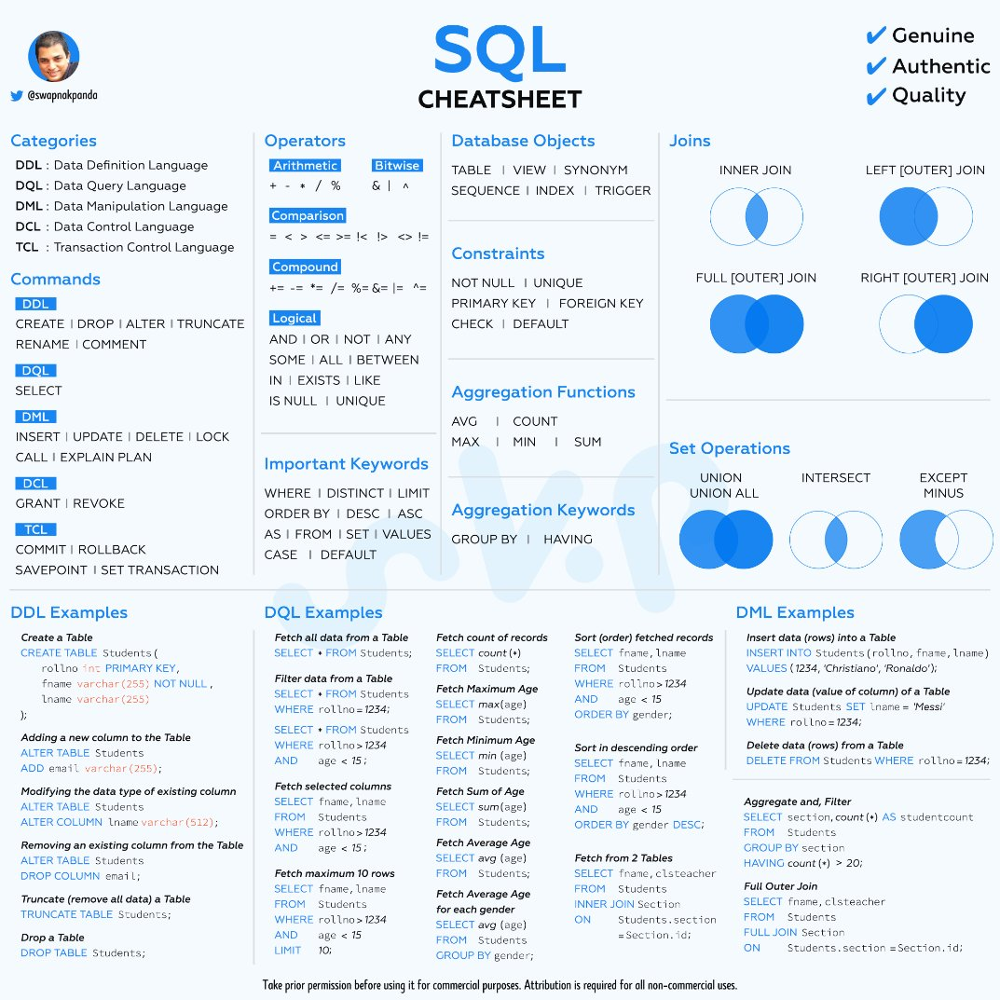

# [MySQL](https://www.udemy.com/course/sql-mysql)

# Introduction and Installation

## Install MySQL on Mac by Docker

Install MySQL Image

```bash
docker run --name udemy-mysql -p 3306:3306 -p 33060:33060 -v /Users/...udemy-mysql-volume:/root -e MYSQL_ROOT_PASSWORD=1234 -d mysql:8
```

Enter MySQL Container

```bash
docker exec -it udemy-mysql bash
```

Enter MySQL

```bash
mysql -u root -p
```

## SQL Cheet Sheet

Made by [Swapna Kumar Panda](https://twitter.com/swapnakpanda/status/1650118619777384449/photo/1).



# Database and Tables

結束的分號可以改變為其他符號，例如 `$$` 。

```sql
delimiter $$
```

查看目前用的 database

```sql
select database();
```

## [Data Types](https://dev.mysql.com/doc/refman/8.0/en/data-types.html)

### [The ENUM Type](https://dev.mysql.com/doc/refman/8.0/en/enum.html)

ENUM 可以讓你限制欄位的值只能是你指定的值。

```sql
CREATE employee (
    gender ENUM('M', 'F')
);
```

## Basic Commands

查看 table 的 schema，也可以用 `DESC` 。

```sql
DESCRIBE table_name;
```

查看 warnings 。

```sql
SHOW WARNINGS;
```


# Date Insertion

多可以一次插入多筆資料。

```sql
INSERT INTO table_name (column1, column2, column3, ...)
VALUES (value1, value2, value3, ...),
       (value1, value2, value3, ...),
       (value1, value2, value3, ...),
       ...
```

## NULL and NOT NULL

MySQL 預設欄位是允許 `NULL` 且如果 insert 時沒有給值，欄位預設值就是 `NULL` 。

可以將欄位設定為 `NOT NULL` ，這樣 insert 時就必須給值。

```sql
CREATE table table_name
(
    column_name data_type NOT NULL
);
```

`Mandatory field` 是指 insert 時必須給值的欄位。


## Default Values

可以設定欄位的預設值。

```sql
CREATE table table_name
(
    column_name data_type DEFAULT default_value
);
```

## Primary Key

可以設定欄位為 Primary Key ，這樣就可以保證欄位的值是唯一。

```sql
CREATE table table_name
(
    column_name data_type PRIMARY KEY
);
```

如果欄位被設定成 Primary Key ，那麼 Insert 時欄位就不能是 `NULL` 且不能有重複的值。

### Composite Primary Key

如果多個欄位組合起來才能保證唯一，那麼就可以將多個欄位設定為 Primary Key 。在 insert 時，這些欄位的組合就必須是唯一的。

```sql
CREATE table table_name
(
    column_name1 data_type,
    column_name2 data_type,
    PRIMARY KEY (column_name1, column_name2)
);
```

## Auto Increment

可以設定欄位為 Auto Increment ，每次 insert 時欄位的值就會自動增加。

```sql
CREATE table table_name
(
    column_name data_type AUTO_INCREMENT
);
```

通常搭配 Primary Key 使用，這樣就可以保證欄位的值是唯一的且會自動增加。用於設定每筆資料的 ID 。

```sql
CREATE table table_name
(
    id INT AUTO_INCREMENT,
    PRIMARY KEY (id)
); 
```

如果想將欄位設定為 Auto Increment ，那麼該欄位必須是 Primary Key 或是 Unique 。

## Unique

可以設定欄位為 Unique ，這樣就可以保證欄位的值是唯一的。

```sql
CREATE table table_name
(
    column_name data_type UNIQUE
);
```

與 PRIMARY KEY 不同的是，欄位可以是 `NULL` ，當欄位是 `NULL` 時，就不會檢查是否有重複的值（多筆資料該欄位可以都是 `NULL` ）。

# CRUD

## 資料匯入

可以使用 `source` 指令匯入資料。

```sql
source /Users/.../data.sql
```

## Update

要注意如果沒加 `WHERE` ，就會將整個欄位的值都改掉。

```sql
UPDATE table_name
SET column_name = value
WHERE condition;
```

## IF NOT EXISTS

如果資料不存在，就新增。也可以用於創建 table 的時候。

```sql
CREATE TABLE IF NOT EXISTS employee(
  id INT NOT NULL AUTO_INCREMENT,
  first_name VARCHAR(100) NOT NULL,
  last_name VARCHAR(100) NOT NULL,
  title VARCHAR(100) DEFAULT NULL,
  salary DOUBLE DEFAULT NULL,
  hire_date DATE NOT NULL,
  notes TEXT,
  PRIMARY KEY (id)
);
```

# Handling Strings

在 select 時，可以把欄位用某個 function 包起來，這樣就可以對欄位做處理。
    
```sql
select some_fun(colum_name,..) as new column_name from table_name;
```


## Concat

### Concatenate Strings

```sql
select CONCAT(first_name, " ", last_name) as full_name from employee;
```

### Concatenate Strings with Separator

```sql
select CONCAT_WS("-", first_name, last_name) as full_name from employee;
```

## Substring

要注意起始是 1 ，不是 0 。

```sql
select SUBSTRING(first_name, 1, 4) from employee;
```

## Replace

不支援 Regex。

# Refining Selections

## Order By

可以用 `DESC` 來反向排序。

可以多個欄位排序，先用第一個欄位排序，如果第一個欄位有重複的值，再用第二個欄位排序。

```sql
select first_name , title, salary from employee order by title, salary DESC;
```

## Limit

可以限制返回資料筆數或是返回資料筆數的範圍。

```sql
select first_name , title, salary from employee order by salary DESC limit 3, 4;
```

如果範圍想要設定至最後，可以用 `limit 3, 18446744073709551615` 。[Ref](https://dev.mysql.com/doc/refman/5.7/en/select.html)

## Like

可以用 `LIKE` 來模糊查詢。

要注意字串比對都是 case insensitive 的。

### `%` 代表任意字元。

`s%` 代表以 `s` 開頭的字串。

`%s` 代表以 `s` 結尾的字串。

`%s%` 代表包含 `s` 的字串。

```sql
select first_name , title, salary from employee where first_name like "%a"
```


### `_` 代表任意一個字元。


`_s` 代表第二個字元是 `s` 的字串。

`_____` 代表長度為 4 的字串。

`H_____` 代表長度為 5 且第一個字元是 `H` 的字串。

```sql
select first_name , title, salary from employee where first_name like "H____"
```

### 跳脫字元

如果想要查詢 DB 裡面字串有 `%` 或 `_` ，可以用 `\` 來跳脫。

```sql
select first_name , title, salary from employee where first_name like "%\%%"
```

# Group and Aggregate

## Distinct

可以用 `DISTINCT` 來去除重複的值。

跟 COUNT 一起使用，可以計算不重複的值有幾個。

```sql
select COUNT(DISTINCT title) from employee;
```

## Group By

`GROUP BY` 會將相同的值分在一起，之後可以進一步對分組的資料做處理。

```sql
-- 取得各個 title 的最高薪資。
 select title, MAX(salary) FROM employee GROUP BY title;
```

## Having

`HAVING` 可以對 `GROUP BY` 後的資料做篩選。

```sql
SELECT title FROM employee GROUP BY title HAVING title="Software Engineer";
```

# Numeric Type

## Integer Types

默認是 signed ，可以是正數或負數。

## Fixed-Point Types

位數是固定的型別。

### DECIMAL

`DECIMAL(5,2)` ，就是總共 5 位數，小數點後 2 位。EX：`123.45` 。

插入的值如果不足位數，就會補 0 。

插入的值如果超過位數，就會被四捨五入。

適合用於貨幣。


## Floating-Point Types

要注意這是一種近似值，不是精確值。因為是用固定長度的位元來表示，所以會有精度的問題。

`FLOAT(5,2)` ，就是總共 5 位數，小數點後 2 位。EX：`123.45` 。要注意插入時就算符合位數，也會有精度問題。

```sql
mysql> create table test4(f float(10,2));
Query OK, 0 rows affected, 1 warning (0.03 sec)

mysql> insert into test4(f) values(131072.32);
Query OK, 1 row affected (0.01 sec)

mysql> select * from test4;
+-----------+
| f         |
+-----------+
| 131072.31 |
+-----------+
1 row in set (0.00 sec)
```

### Bit-Value Type

可以用來存放二進位的值。存入的值都會被轉成二進位。

取出時可以用 `column_name + 0` 來轉回十進位。

```sql
SELECT a, a+0 FROM your_table;
```

也可以使用 `BIN()` 來轉回二進位。

```sql
mysql> select b, b+0, BIN(b) from test5;
+------------+------+--------+
| b          | b+0  | BIN(b) |
+------------+------+--------+
| 0x0F       |   15 | 1111   |
+------------+------+--------+
1 row in set (0.00 sec)
```

Insert 時可以用 可以使用 `b'1111'` 或 `0b1111` 來表示 BIT 值的二進制字串。

```sql
insert into test5(b) values(0b1111);
```

# Date and Time

可以是 Null，但是必須主動加入。

獲取當前時間：

```sql
select now();
```


## Date

'YYYY-MM-DD'。

系統會自動檢查日期是否合法，但也 insert 時也有彈性。比如可以直接 Insert 20230702，系統會自動轉成 2023-07-02。


## Time

'HH:MM:SS'。

但也可以表示時間間隔，所以範圍可以是 '-838:59:59' 到 '838:59:59' 。

如果資料格式沒有完整，要注意默認值是是什麼：

- "HH:MM" 會默認為 'HH:MM:00' 。

- "SS" 會默認為 '00:00:SS' 。

## Year

範圍是 1901 到 2155 。

可以用字串或是數字來插入。

如果格式不完整，也是要注意默認值是什麼：

**數字**

- 1 到 69 會被轉換成 2000 到 2069 。
    - 1 -> 2001。
- 70 到 99 會被轉換成 1970 到 1999 。
    - 70 -> 1970。
- 0 -> 0000。

**字串**

- "0" 到 "69" 會被轉換成 2000 到 2069 。
    - "0" -> 2000。
- "70" 到 "99" 會被轉換成 1970 到 1999 。
    - "70" -> 1970。

## Datetime and Timestamp

### Datetime

'YYYY-MM-DD HH:MM:SS'。

範圍是 '1000-01-01 00:00:00' 到 '9999-12-31 23:59:59' 。

### Timestamp

不同版本的 MySQL 有會有不同的默認值行為。有可能會在 `Default` 加上`CURRENT_TIMESTAMP` ，在`Extra` 加上 `on update CURRENT_TIMESTAMP` 。

要注意範圍是 `1970-01-01 00:00:01` UTC  到 `2038-01-19 03:14:07` UTC。


> ChatGPT 解釋 Timestamp 是這個範圍的原因
> 
> 這是因為 Timestamp 在許多系統中使用的是 32 位元整數來表示，並以秒為單位來儲存從 Unix 紀元（1970 年 1 月 1 日 00:00:00 UTC）開始的時間。由於使用 32 位元整數，它的範圍被限制在特定的範圍內。
在 32 位元整數中，最大正整數可以表示的範圍是約 2,147,483,647（即 2^31 - 1），因為其中一位被用來表示正負號。將這個範圍轉換為秒，約為 68 年。
> 
> 因此，Timestamp 的範圍是由紀元開始的 68 年，即從 1970-01-01 00:00:00 UTC 到約為 2038-01-19 03:14:07 UTC。這個時間點稱為「2038 年問題」，在該時間點之後，32 位元整數將無法正確表示 Timestamp。
>
> 為了解決這個問題，許多系統已經開始使用 64 位元整數來表示 Timestamp，或使用其他時間表示方法（如使用 BigInt 儲存毫秒數）來擴展時間範圍。
> 
> 重要的是要注意，Timestamp 的範圍限制是特定於使用 32 位元整數來表示的實現。在使用其他儲存格式或表示方式的系統中，可能有不同的時間範圍限制。


### 比較

Datetime 可以存放 1000 到 9999 年的時間，而 Timestamp 只能存放 1970 到 2038 年的時間。

Timestamp 會自動跟著 MySQL 伺服器的時區變化，而 Datetime 不會。

For index, Timestamp 比 Datetime 快。

## Time Zone

看 MySQL 時區：

```sql
mysql> SHOW variables LIKE '%time_zone%'
+------------------+--------+
| Variable_name    | Value  |
+------------------+--------+
| system_time_zone | UTC    |
| time_zone        | SYSTEM |
+------------------+--------+
2 rows in set (0.02 sec)
```

設定時區：

```sql
SET time_zone = '+08:00';
-- or
SET time_zone = 'Asia/Taipei';
```

要注意有兩種時區，一種是 MySQL 伺服器的時區，一種是 MySQL 連線的時區。

> ChatGPT
> 在 MySQL 中，system_time_zone 和 time_zone 是兩個相關的設定，用於處理日期和時間的時區相關問題。
>
> system_time_zone：這個設定代表 MySQL 伺服器的系統時區。它會影響 MySQL 伺服器內部處理日期和時間的方式，例如當使用 NOW()、CURRENT_TIMESTAMP() 或其他日期和時間函數時，它們所返回的結果會基於這個系統時區。
>
> time_zone：這個設定代表 MySQL 連線的客戶端時區。它會影響 MySQL 伺服器將日期和時間轉換為連線客戶端所在時區的方式。當 MySQL 伺服器接收到來自客戶端的日期和時間值時，它會根據這個時區設定進行適當的轉換。
>
> 總結而言，system_time_zone 用於指定 MySQL 伺服器內部的系統時區，而 time_zone 用於指定連線的客戶端時區。這兩個設定都影響 MySQL 在處理日期和時間時的行為，包括儲存、顯示和轉換日期和時間值。

# String Type

## char and varchar

### char 

固定長度 string (0~255)。

存 `"    "` 就會是 `"    "` 。

### varchar

可變長度 string (0~65535)。更新時因為會需要調整空間，所以會比 char 慢。

存 `"    "` 會變 `""` 。

### 查看長度

查看幾個字符
    
```sql
select char_length(a), char_length(b) from 92_char_varchar;
```

查看幾個 bytes

```sql
select length(a), length(b) from 92_char_varchar;
```

## BINARY String Type

### BINARY

會自動在結尾補 0x00 到指定長度。

### VARBINARY

不會自動在結尾補 0x00 到指定長度。

## BLOB and TEXT

### BLOB

BLOB 是用於存儲二進位數據（例如圖片、影音、文件等）的資料類型。

BLOB 存儲的數據以二進位形式存儲，不進行任何字符編碼轉換。

BLOB 在資料庫中佔用的空間與實際數據大小相同。

### TEXT

TEXT 是用於存儲文本數據的資料類型，例如長文本、文章內容等。

因為資料長度通常很長，所以可以用 `set max_sort_length = 1000` 來設定排序時只看前 1000 個字元。

## ENUM

一個 primitive value 的 list 。

創建時指定 list 的值，插入時只能插入 list 裡面的值。

```sql
create table 95_enum(n varchar(5), size enum('xs','s','m','l','xl'));
```

插入時可以直接使用 Index 。

```sql
mysql> insert into 95_enum values(1, 1);
Query OK, 1 row affected (0.01 sec)

mysql> select * from 95_enum;
+------+------+
| n    | size |
+------+------+
| 1    | xs   |
+------+------+
1 row in set (0.00 sec)
```

Insert 或 select 時，會比直接 string 類的 type 快。

## SET

可以紀錄一組組合。最大可以有 64 個不同 member。

```sql
create table 96_set(id varchar(2), order_set set('xs','s','m','l','xl'));
```

Insert 時要注意，逗號之間不能有空白。
```sql
mysql> insert into 96_set (id, order_set) values (1, 's, l');
ERROR 1265 (01000): Data truncated for column 'order_set' at row 1
mysql> insert into 96_set (id, order_set) values (1, 's,l');
Query OK, 1 row affected (0.01 sec)
```

如果要用 set 的 index 來新增，因為有多種組合，所以要注意。Index 是依照二進位來表示，

```sql
mysql> create table 96_set(id varchar(2), order_set set('s','m','l'));
Query OK, 0 rows affected (0.03 sec)
mysql> insert into 96_set (id, order_set) values (1, 1);
Query OK, 1 row affected (0.02 sec)

mysql> insert into 96_set (id, order_set) values (2, 2);
Query OK, 1 row affected (0.01 sec)

mysql> insert into 96_set (id, order_set) values (3, 3);
Query OK, 1 row affected (0.01 sec)

mysql> insert into 96_set (id, order_set) values (4, 4);
Query OK, 1 row affected (0.01 sec)

mysql> insert into 96_set (id, order_set) values (5, 5);
Query OK, 1 row affected (0.01 sec)

mysql> insert into 96_set (id, order_set) values (6, 6);
Query OK, 1 row affected (0.00 sec)

mysql> insert into 96_set (id, order_set) values (7, 7);
Query OK, 1 row affected (0.00 sec)

mysql> insert into 96_set (id, order_set) values (8, 8);
ERROR 1265 (01000): Data truncated for column 'order_set' at row 1
```

SET 的 index 是用二進位來表示組合內容，

```sql
mysql> select * from 96_set;
+------+-----------+
| id   | order_set |
+------+-----------+
| 0    |           |
| 1    | s         |
| 2    | m         |
| 3    | s,m       |
| 4    | l         |
| 5    | s,l       |
| 6    | m,l       |
| 7    | s,m,l     |
+------+-----------+
8 rows in set (0.01 sec)
```

| index | l   | m   | s   | present set    |
| ----- | --- | --- | --- | --- |
| 0     | 0   | 0   | 0   |     |
| 1     | 0   | 0   | 1   | s   |
| 2     | 0   | 1   | 0   | m   |
| 3     | 0   | 1   | 1   | m,s |
| 4     | 1   | 0   | 0   | l   |
| 5     | 1   | 0   | 1   | l,s |
| 6     | 1   | 1   | 0   | l,m |
| 7     | 1   | 1   | 1   | l,m,s |


# Logical Operators

## EQUAL and NOT EQUAL

## LIKE and NOT LIKE

要注意字串比對都是 case insensitive 的。

```sql
mysql> select * from 99_employee where first_name like '%E%';
+----+------------+-----------+--------------------+--------+------------+-------+
| id | first_name | last_name | title              | salary | hire_date  | notes |
+----+------------+-----------+--------------------+--------+------------+-------+
|  5 | Eliza      | Clifford  | Software Engineer  |   4750 | 1998-10-19 | NULL  |
|  7 | Melinda    | Clifford  | Project Manager    |   8500 | 2013-10-29 | NULL  |
|  9 | Harley     | Gilbert   | Software Architect |   8000 | 2000-07-17 | NULL  |
+----+------------+-----------+--------------------+--------+------------+-------+
3 rows in set (0.00 sec)
```

如果要區分大小寫，查詢時可以加 `BINARY` 。或是直接在 table 設定。

```sql
mysql> select * from 99_employee where first_name like binary '%E%';
+----+------------+-----------+-------------------+--------+------------+-------+
| id | first_name | last_name | title             | salary | hire_date  | notes |
+----+------------+-----------+-------------------+--------+------------+-------+
|  5 | Eliza      | Clifford  | Software Engineer |   4750 | 1998-10-19 | NULL  |
+----+------------+-----------+-------------------+--------+------------+-------+
1 row in set, 1 warning (0.01 sec)
```

## Greater Than and Less Than

## AND and OR

## BETWEEN

包含起點和終點。

```sql
mysql> select * from 99_employee where salary between 6000 and 8000;
+----+------------+-----------+------------------------+--------+------------+-------+
| id | first_name | last_name | title                  | salary | hire_date  | notes |
+----+------------+-----------+------------------------+--------+------------+-------+
|  2 | Taylor     | Edward    | Software Architect     |   7200 | 2002-09-21 | NULL  |
|  3 | Vivian     | Dickens   | Database Administrator |   6000 | 2012-08-29 | NULL  |
|  4 | Harry      | Clifford  | Database Administrator |   6800 | 2015-12-10 | NULL  |
|  8 | Jack       | Chan      | Test Engineer          |   6500 | 2018-09-07 | NULL  |
|  9 | Harley     | Gilbert   | Software Architect     |   8000 | 2000-07-17 | NULL  |
+----+------------+-----------+------------------------+--------+------------+-------+
5 rows in set (0.00 sec)
```

## IN and NOT IN

查詢資料在不在某個 list 裡面。


```sql
mysql> select * from 99_employee where salary in (5000, 6000, 7000, 8000);
+----+------------+-----------+------------------------+--------+------------+-------+
| id | first_name | last_name | title                  | salary | hire_date  | notes |
+----+------------+-----------+------------------------+--------+------------+-------+
|  3 | Vivian     | Dickens   | Database Administrator |   6000 | 2012-08-29 | NULL  |
|  9 | Harley     | Gilbert   | Software Architect     |   8000 | 2000-07-17 | NULL  |
+----+------------+-----------+------------------------+--------+------------+-------+
2 rows in set (0.00 sec)
```

## CASE Statement

條件判斷。可以將生成新欄位的值依照條件來決定。

```sql
SELECT *,
     case 
         when salary>=7000 then "high"
         else 'low'
     end as tag
 from 99_employee order by salary desc;

+----+------------+-----------+------------------------+--------+------------+-------+------+
| id | first_name | last_name | title                  | salary | hire_date  | notes | tag  |
+----+------------+-----------+------------------------+--------+------------+-------+------+
| 16 | Melinda    | Clifford  | Project Manager        |   8500 | 2013-10-29 | NULL  | high |
|  7 | Melinda    | Clifford  | Project Manager        |   8500 | 2013-10-29 | NULL  | high |
| 18 | Harley     | Gilbert   | Software Architect     |   8000 | 2000-07-17 | NULL  | high |
|  9 | Harley     | Gilbert   | Software Architect     |   8000 | 2000-07-17 | NULL  | high |
|  2 | Taylor     | Edward    | Software Architect     |   7200 | 2002-09-21 | NULL  | high |
| 11 | Taylor     | Edward    | Software Architect     |   7200 | 2002-09-21 | NULL  | high |
|  4 | Harry      | Clifford  | Database Administrator |   6800 | 2015-12-10 | NULL  | low  |
| 13 | Harry      | Clifford  | Database Administrator |   6800 | 2015-12-10 | NULL  | low  |
|  8 | Jack       | Chan      | Test Engineer          |   6500 | 2018-09-07 | NULL  | low  |
| 17 | Jack       | Chan      | Test Engineer          |   6500 | 2018-09-07 | NULL  | low  |
| 12 | Vivian     | Dickens   | Database Administrator |   6000 | 2012-08-29 | NULL  | low  |
|  3 | Vivian     | Dickens   | Database Administrator |   6000 | 2012-08-29 | NULL  | low  |
| 10 | Robin      | Jackman   | Software Engineer      |   5500 | 2001-10-12 | NULL  | low  |
|  1 | Robin      | Jackman   | Software Engineer      |   5500 | 2001-10-12 | NULL  | low  |
|  6 | Nancy      | Newman    | Software Engineer      |   5100 | 2007-01-23 | NULL  | low  |
| 15 | Nancy      | Newman    | Software Engineer      |   5100 | 2007-01-23 | NULL  | low  |
|  5 | Eliza      | Clifford  | Software Engineer      |   4750 | 1998-10-19 | NULL  | low  |
| 14 | Eliza      | Clifford  | Software Engineer      |   4750 | 1998-10-19 | NULL  | low  |
+----+------------+-----------+------------------------+--------+------------+-------+------+
18 rows in set (0.00 sec)
```


