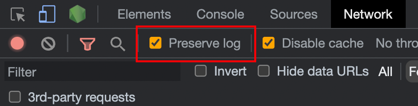

# Uncategory


## Mac

- Mac terminal 完全清除已顯示的 log: `command` + k

## Linux  

- `cat /proc/cpuinfo`: 列出硬體基本資訊  
- `ls`
  - `-t`：依時間排序，而不是用檔名。
  - `-h`：將檔案容量以人類較易讀的方式(例如 GB, KB 等等)列出來。
- `df -h`: 看空間大小  
- `lsb_release -a` or `/etc/os-release` or `Raspbian GNU/Linux 10 `: 查看 OS 發佈版。  
- 套件管理  
  - APT（Advanced Packaging Tool）： Debian 和 Ubuntu。  
  - Yum（Yellowdog Updater, Modified）： Red Hat、CentOS 和 Fedora Linux 分。  
  - DNF（Dandified Yum）：Yum 的替代品，Red Hat、CentOS 和 Fedora Linux 。  
  - Zypper： openSUSE 和 SUSE Linux Enterprise Server 。  
  - Pacman：Arch Linux 。  
- `apt list | grep vim`: 查看是否已安裝過某個軟體。  
- `sudo apt purge nodejs npm`: 移除套件，`purge` 會連帶移除相依的套件。  
- `man`  
  - `b/空白`：上/下一頁  
  - `/目標`：搜尋。用 `N/n` 來跳 上/下 一個目標。  
  - `?目標`：向上搜尋。
- `ssh -vvv user@host`: 查看 ssh 連線過程。
  - `-vvv`：最詳細的 log。
- `grep`
  - `-E 'regex'`：使用正規表達式。
  - `-i 'string'`：忽略大小寫。
- `nmap -sP 192.168.1.0/24`: 掃描網路上的裝置。
- `nmap -p 22 --open -sV 192.168.1.0/24`: 掃描網路上的裝置，並列出有開啟 22 port 的裝置。
- `curl http://myexternalip.com/raw` or `curl http://ipecho.net/plain`: 查看外部 IP。
- `sudo ufw status`: 查看防火牆狀態。
- `ufw allow to any port 31880`: 開放 31880 port。
- `uname -a`: 查看 Linux 版本。
- `cmd + UP`: 跳至最後一次下指令的地方。
- `ps -aux | grep [name]`: 查看某個程式是否有在執行。
- `printenv`: 查看環境變數。
- [開機自動執行](https://blog.twshop.asia/ubuntu-18-04-%E9%96%8B%E6%A9%9F%E8%87%AA%E5%8B%95%E5%9F%B7%E8%A1%8C%E7%A8%8B%E5%BC%8F/)
- [使用 systemd 避免複雜性](https://mgdm.net/weblog/systemd/): 如何使用 systemd 架設一個開機啟動的網站。

## 連線至 gateway

Mac 下載 Coolterm ，然後將 mac 與 gateway 接 USB。

在設定中掃 port 會看到對應的接口，就可以連線登入進 gateway。

或是先進入 `cd /dev/`
```
ls cu.*  // 列出先在有的
```
應該會找到一個類似 cu.usbmodem14201 的接口，接著測試連線的速度：

```
stty -f cu.usbmodem14201 speed
```

連線

```
cat cu.usbmodem14201 & stty -f cu.usbmodem14201 9600
```

把執行搬到前景

```
fg
```

開另一個 terminal 視窗，對它下指令，一開始下幾個enter

```
 echo -ne "\n" > cu.usbmodem14201
```

回到 fg 的視窗，會看到有反應, 接著登入

```
echo -ne "admin\n" > cu.usbmodem14201
echo -ne "password\n" > cu.usbmodem14201
```

下 ifconfig

```
echo -ne "sudo -i\n" > cu.usbmodem14201
echo -ne "password\n" > cu.usbmodem14201
echo -ne "ifconfig\n" > cu.usbmodem14201
```

就可以看到 ip了

## Issues

**ssh: Could not resolve hostname [Host]: nodename nor servname provided, or not known**

- 如果直接 ping HostName 有通，檢查 .ssh/config 是否有設定是否正確，是否有 typo。
- `ssh -vvv [HostName]`: 查看 ssh 連線過程。如果有出現 `debug1: Connecting [Host] to host port 22.` 表示 ssh 設定檔可能有問題，備份 `.ssh/know_hosts` 後，刪除 `.ssh/know_hosts` 後再試試看。

**如果要處理有關時間序的問題，像是上一筆和這一筆，要注意撈上一筆的資料不能單純撈最新的一筆，要再加上時間小於本筆的條件。**

## Web

網頁切換頁面時，開啟 preserve log 可以儲存 request 紀錄。


### CSS

[樹狀視圖的 CSS 實現](https://iamkate.com/code/tree-views/)

### Tailwind

- [Headwind](https://marketplace.visualstudio.com/items?itemName=heybourn.headwind): 排序 tailwind 的 class 的 vscode plugin。

- [Tailwind Docs](https://marketplace.visualstudio.com/items?itemName=austenc.tailwind-docs): 可以在 vscode 快速開啟 tailwind 文件網站。

- [@tailwindcss/typography](https://tailwindcss.com/docs/typography-plugin): 讓文字內容有基礎的排版樣式。如果單純從資料庫中讀取一堆基礎 html 格式，可以使用這個。

## Drawio

匯出時選 PNG ，選擇`包含我的圖表的副本`後，此 PNG 可以再度用 drawio 編輯。

匯出固定選`300%`，寬度選`15`。　

## Resources
- [100 Bytes of CSS to look great everywhere](https://www.swyx.io/css-100-bytes)
  - 用簡單的 CSS 設定讓網站看起來還不錯。
- [Effective Shell](https://effective-shell.com/)
  - Shell 的教學。
- [Watching You](https://github.com/jj811208/watching-you)
  - 可以做出像小狐狸錢包那樣的注視效果

- [SadServers](https://sadservers.com/scenarios)
   - 練習 LINUX 情境處理。

- [regex101]
    - 可以學習和理解正則表達式的網站。

# Github Issue Markdown

讓圖片可以並排顯示：

```md


or
// 50 有時還是會換行
<div style="display: flex;">
    
    
</div>
```
